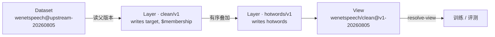

<div align="center">

# audio-data-contract

**语音数据集的版本、文件位置与处理血缘管理**

声明留在仓库里，音频留在数据盘和对象存储上。下游只认数据 ID 和版本，不猜路径、不拼文件名。

[文档](docs/README.md) · [数据总览](docs/datasets/data-overview.md) · [声明格式](catalog/README.md) · [数据组织规范](docs/reference/data-organization.md)

[](https://github.com/amphionspace/audio-data-contract/actions/workflows/ci.yml) [](pyproject.toml) [](src/audio_data_contract/schemas/)

</div>

---

## 它解决什么问题

同一份数据集经过清洗、标点恢复、热词提取之后会产生好几份 manifest。历史做法是把变换写进目录名：

```text
.../WenetSpeech/.../clean/
.../WenetSpeech/.../cleaned/
.../WenetSpeech/.../hotwords/
```

哪份对应哪次处理、用了什么参数、还能不能用，没人说得清。

这个仓库把身份、血缘和可用状态写成声明。下游给一个 View ID 和版本，拿回确定的答案：

```console
$ audio-data-contract resolve-view views catalog wenetspeech/clean v3-20260828
{"dataset_id": "wenetspeech_clean", "dataset_version": "clean-v3-20260828",
 "materialization": "full", "view_id": "wenetspeech/clean", "view_version": "v3-20260828",
 "transforms": [{"name": "clean", "version": "consensus-v6+wenetspeech-faithful-v5",
   "kind": "filter-and-correct", "writes": ["$membership", "target", "metadata.clean"],
   "overrides": ["target"], "parameters": {"pass_count": 14568791, ...}}]}
```

> 实际输出为单行 JSON，这里换行便于阅读。

## 三个对象



| 对象 | 是什么 | 稳定身份 |
|---|---|---|
| **Dataset** | 不可变的源数据事实和物理产物。`dataset_id` 只表示来源，不表示处理 | `wenetspeech@upstream-20260805` |
| **Layer** | 一次可复现的变换。按记录 ID 存稀疏增量，声明父版本、写入字段、参数、工具和模型版本 | `clean/v1` |
| **View** | 源 Dataset 顺序套上若干 Layer 得到的逻辑版本，下游唯一入口 | `wenetspeech/clean@v1-20260805` |

默认禁止两个 Layer 写同一字段；确实要覆盖，后一个必须显式声明 `overrides`，否则校验器拒绝。完整规则见[数据组织规范](docs/reference/data-organization.md)。

协议字段不依赖训练框架。Icefall 适配参数与 Lhotse 文件引用用于现有数据接入，其他使用方按 Schema 读取声明和样本即可。

## 安装

需要 Python 3.10 或以上。

```bash
python -m pip install -e .
```

## 快速开始

以下三步只读取仓库里的声明，不需要本地音频。

```console
$ audio-data-contract validate-catalog catalog
{"datasets": 363}

$ audio-data-contract validate-views views catalog
{"views": 28}

$ audio-data-contract resolve-view views catalog wenetspeech/clean v3-20260828
```

## 访问数据文件

声明里不写绝对路径，只写「根目录别名 + 相对路径」。在本机建一个 `roots.json` 把别名映射到数据盘：

```json
{
  "legacy_asr": "/data/asr"
}
```

完整别名列表见 [roots.example.json](roots.example.json)。`resolve` 只解析路径，不碰文件：

```console
$ audio-data-contract resolve catalog wenetspeech_clean clean-v3-20260828 \
      train_supervisions --roots roots.json
/data/asr/WenetSpeech/lhotse/clean/v3-firered/wenetspeech_supervisions_L_clean.jsonl.gz
```

文件就绪后，用 `verify-artifact` 核对登记的大小、哈希和记录数：

```bash
audio-data-contract verify-artifact catalog wenetspeech_clean clean-v3-20260828 \
    train_supervisions --roots roots.json
```

> [!IMPORTANT]
> `roots.json` 不提交到仓库，也可以用 `AUDIO_DATA_ROOTS_FILE` 指定位置。
> 换机器或数据搬家时只改这一个文件，声明不动。

> [!NOTE]
> 登记不代表本机文件已齐备。来源声明可以先登记预期产物，`download_planned` 条目不宣称文件已存在。

## 可选能力

```bash
python -m pip install -e '.[duration]'
```

| extra | 主要依赖 | 用途 |
|---|---|---|
| `duration` | `orjson` `rapidgzip` `soundfile` | 统计清单或音频目录，补齐 catalog 缺失时长 |
| `preparation` | `lhotse` `soundfile` `textgrid` `scipy` | 从归档生成本地清单和音频副本 |
| `backup` | `cos-python-sdk-v5` `zstandard` | COS 备份、校验与恢复 |
| `lance` | `pylance` `pyarrow` | Lance 查询 / 清洗后端与训练直读；JSONL + Layer 仍是权威来源。也用于读取 [DATA-TTS-UNIFIED](docs/datasets/tts-unified.md) 的 Lance 发布 |
| `dev` | `jsonschema` `pytest` `ruff` | 校验、测试、lint |

[Lance 物化](docs/lance-materialization.md)提供固定 snapshot、标量索引查询、规范 Layer 回写、版本治理、对象存储只读镜像和分片训练读取。
合成数据规模验收见[生产化报告](reports/lance-prod-20261004/README.md)；真实全量数据验收通过后再在 catalog 正式登记。

## 仓库结构

| 目录 | 内容 |
|---|---|
| [catalog/](catalog/README.md) | YAML 数据声明：版本、划分、文件引用、时长和来源 |
| [views/](views/) | YAML View 声明：源版本、处理步骤和结果版本 |
| [src/audio_data_contract/](src/audio_data_contract/) | 读取、校验、路径解析工具及 [JSON Schema](src/audio_data_contract/schemas/) |
| [scripts/](scripts/) | 下载、转换、准备和备份脚本；Icefall 训练专用的数据准备工具由 icefall 仓库维护 |
| [docs/](docs/README.md) | 使用说明、数据专题、协议规范和历史记录 |
| [reports/](reports/) | 核查报告、统计结果和验收记录 |

## 开发

```bash
python -m pip install -e '.[dev,duration,backup,lance,preparation]'

audio-data-contract validate-catalog catalog
audio-data-contract validate-views views catalog
audio-data-contract generate-overview
ruff check .
pytest -q
```

改完数据声明要重新生成总览；CI 用 `generate-overview --check` 检查 Markdown 和图表是否同步。登记字段及统计口径见 [catalog/README.md](catalog/README.md)。

> [!WARNING]
> Schema 位于 `src/audio_data_contract/schemas/`。新增必填字段、删除字段或改变字段含义需要新版本；同一版本只接受向后兼容的修改。

## 许可

Apache-2.0，见 `pyproject.toml` 的 `license` 字段。
