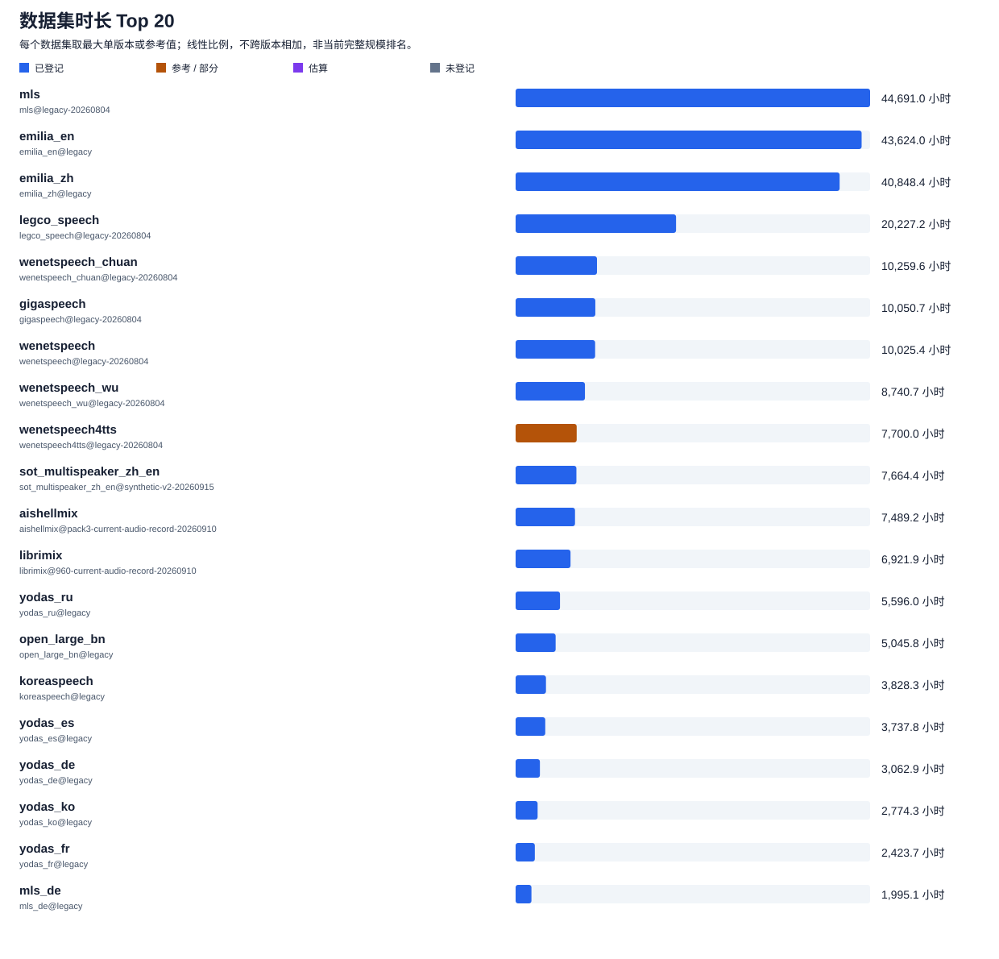

# 数据总览

按数据集查看语言、支持任务、时长和特性。清洗、热词、加噪、评测入口和训练框架配置归入所属数据集，不另算一套源数据。

当前登记 **118 个数据集条目**；另有 **20 个下载来源声明**和 **1 个训练混合配方**。登记不代表本机文件已齐备。

时长单位为小时。不同版本、子集和标注片段可能重叠，逐项列出，不相加为总量；没有时长的条目仍保留。参考表数字未核实当前文件与划分覆盖；“过滤前”不能当作清洗后时长。

任务是该数据集各已登记版本的能力并集，具体版本和划分以链接内声明为准。标点、热词和文件哈希校验都不能单独证明做过内容清洗。

## 数据规模与登记覆盖

每个数据集仅取最大的一项完整版本登记、参考或估算时长，并标出对应版本。部分划分和过滤前时长不参与排名；不同颜色区分登记值与参考 / 估算值。排名用于查看量级，不代表最新版本或整个数据集的完整时长。

覆盖图按数据集互斥分类：优先计入“至少一个版本有完整时长登记”，其次是“仅参考、估算或部分时长”，其余为“尚未登记”。完整登记只针对对应版本，不代表整个数据集所有子集和版本均已覆盖。

## 英文数据

| 数据集 | 语言 | 支持任务 | 时长（小时，注明范围） | 特性 / 备注 |
|---|---|---|---|---|
| [ami](../../catalog/icefall_runtime.yaml#L3193) | en | 语音识别 | 92.1（已登记；[单远场麦克风标注片段](../../catalog/icefall_runtime.yaml#L3193)） | 标注片段时长，重叠语音或多麦克风可能重复计时。训练集缺少 2 场会议（134/136） |
| [audioset_esc_test](../../catalog/open_audio_eval.yaml#L1252) | en | 背景声场景描述 | 6.8（已登记；[eval-20260804](../../catalog/open_audio_eval.yaml#L1252)） | 当前仅登记评测入口 |
| [chime6](../../catalog/chime6.yaml#L1) | en | 语音识别、重叠语音检测、带说话人标注的语音识别、说话人分段与归属 | 56.3（已登记；[speaker-records-v1-20260912](../../catalog/chime6.yaml#L139)） | 家庭聚会中的多通道远场和重叠语音；包含音频、官方转写、房间布局和许可文件。 官方转写原包保留尾随字节问题；标注入口使用解压内容不变、通过 CRC 校验的修复归档；已解包、实测音频头并生成通用说话人记录；保留官方划分和标注 |
| [common_voice_en](../../catalog/local_lhotse_derived.yaml#L286) | en | 语音识别、热词增强语音识别 | 1,862.7（已登记；[icefall-20260908](../../catalog/icefall_runtime.yaml#L307)） 1,862.7（已登记；[legacy-20260804](../../catalog/icefall_base.yaml#L250)） 27.2（已登记；[eval-20260804](../../catalog/open_audio_eval.yaml#L253)） 1,835.4（已登记；[clean-v1-20260805](../../catalog/local_lhotse_derived.yaml#L286)） 27.2（已登记；[eval-20260804](../../catalog/open_audio_eval.yaml#L316)） 1,835.4（已登记；[hotwords-v1-20260805](../../catalog/local_lhotse_derived.yaml#L382)） 27.2（已登记；[eval-20260804](../../catalog/open_audio_eval.yaml#L1536)） 27.2（已登记；[eval-20260804](../../catalog/open_audio_eval.yaml#L2174)） 27.2（已登记；[eval-20260804](../../catalog/open_audio_eval.yaml#L1507)） 27.2（已登记；[eval-20260804](../../catalog/open_audio_eval.yaml#L2145)） 27.2（已登记；[eval-20260804](../../catalog/open_audio_eval.yaml#L1478)） 27.2（已登记；[eval-20260804](../../catalog/open_audio_eval.yaml#L2116)） 27.2（已登记；[eval-20260804](../../catalog/open_audio_eval.yaml#L1420)） 27.2（已登记；[eval-20260804](../../catalog/open_audio_eval.yaml#L2058)） 27.2（已登记；[eval-20260804](../../catalog/open_audio_eval.yaml#L1391)） 27.2（已登记；[eval-20260804](../../catalog/open_audio_eval.yaml#L2029)） 27.2（已登记；[eval-20260804](../../catalog/open_audio_eval.yaml#L1449)） 27.2（已登记；[eval-20260804](../../catalog/open_audio_eval.yaml#L2087)） 27.2（已登记；[eval-20260804](../../catalog/open_audio_eval.yaml#L1565)） 27.2（已登记；[eval-20260804](../../catalog/open_audio_eval.yaml#L2203)） 27.2（已登记；[eval-20260804](../../catalog/open_audio_eval.yaml#L1362)） 27.2（已登记；[eval-20260804](../../catalog/open_audio_eval.yaml#L2000)） 27.2（已登记；[eval-20260804](../../catalog/open_audio_eval.yaml#L1275)） 27.2（已登记；[eval-20260804](../../catalog/open_audio_eval.yaml#L1913)） 27.2（已登记；[eval-20260804](../../catalog/open_audio_eval.yaml#L1333)） 27.2（已登记；[eval-20260804](../../catalog/open_audio_eval.yaml#L1971)） 27.2（已登记；[eval-20260804](../../catalog/open_audio_eval.yaml#L1304)） 27.2（已登记；[eval-20260804](../../catalog/open_audio_eval.yaml#L1942)） 1,854.0（[参考表](https://ccnuebbmik1f.feishu.cn/wiki/CEXFwEjPoi2bIukVjk9c5FdOn12?sheet=3d4d23)；legacy-20260804） | Qwen3-ASR-1.7B + whisper-large-v3 双引擎筛选；train 需过滤 1,127 条失败记录；test 清单尚未应用筛选结果；含派生版本（与源数据可能重叠） |
| [cs_dialogue_en](../../catalog/icefall_base.yaml#L1615) | en | 语音识别 | 26.6（已登记；[icefall-20260908](../../catalog/icefall_runtime.yaml#L2222)） 26.6（已登记；[legacy-20260804](../../catalog/icefall_base.yaml#L1615)） | 已登记划分：dev、test、train |
| [emilia_en](../../catalog/legacy_multilingual.yaml#L601) | en | 语音识别 | 43,624.0（已登记；[legacy](../../catalog/legacy_multilingual.yaml#L601)） | 参考表注明 clean2604，Whisper + Qwen3ASR 转录、已有清洗；本次未复核实际样本；有含标点版本 |
| [emotion1200_en](../../catalog/open_audio_eval.yaml#L919) | en | 说话人情感分类、情感与说话风格描述、语音情感识别 | 5.2（已登记；[eval-20260804](../../catalog/open_audio_eval.yaml#L919)） 5.2（已登记；[eval-20260804](../../catalog/open_audio_eval.yaml#L977)） 5.2（已登记；[eval-20260804](../../catalog/open_audio_eval.yaml#L861)） | 当前仅登记评测入口 |
| [fleurs_en](../../catalog/legacy_multilingual.yaml#L558) | en | 语音识别 | 10.3（已登记；[legacy](../../catalog/legacy_multilingual.yaml#L558)） | 有含标点版本 |
| [gigaspeech](../../catalog/icefall_base.yaml#L181) | en | 语音识别 | 40.3（已登记；[eval-20260804](../../catalog/open_audio_eval.yaml#L197)） 10,050.7（已登记；[icefall-20260908](../../catalog/icefall_runtime.yaml#L225)） 10,050.7（已登记；[legacy-20260804](../../catalog/icefall_base.yaml#L181)） 10,000.0（[参考表](https://ccnuebbmik1f.feishu.cn/wiki/CEXFwEjPoi2bIukVjk9c5FdOn12?sheet=3d4d23)；legacy-20260804） | 已登记划分：dev、test、train |
| [iemocap_ser](../../catalog/open_audio_eval.yaml#L795) | en | 语音情感识别 | 1.5（已登记；[eval-20260804](../../catalog/open_audio_eval.yaml#L795)） | 当前仅登记评测入口 |
| [legco_speech_en](../../catalog/icefall_base.yaml#L1799) | en | 语音识别 | 249.6（已登记；[icefall-20260908](../../catalog/icefall_runtime.yaml#L2436)） 249.6（已登记；[legacy-20260804](../../catalog/icefall_base.yaml#L1799)） | 已登记划分：train |
| [libri2mix](../../catalog/open_audio_eval.yaml#L1108) | en | 目标说话人语音识别 | 8.4（已登记；[eval-20260804](../../catalog/open_audio_eval.yaml#L1108)） 8.4（已登记；[eval-20260804](../../catalog/open_audio_eval.yaml#L1204)） 8.4（已登记；[eval-20260804](../../catalog/open_audio_eval.yaml#L1156)） 11.2（已登记；[eval-20260804](../../catalog/open_audio_eval.yaml#L1035)） | 当前仅登记评测入口 |
| [libri3mix](../../catalog/open_audio_eval.yaml#L1132) | en | 目标说话人语音识别 | 10.9（已登记；[eval-20260804](../../catalog/open_audio_eval.yaml#L1132)） 10.9（已登记；[eval-20260804](../../catalog/open_audio_eval.yaml#L1228)） 10.9（已登记；[eval-20260804](../../catalog/open_audio_eval.yaml#L1180)） 16.3（已登记；[eval-20260804](../../catalog/open_audio_eval.yaml#L1059)） | 当前仅登记评测入口 |
| [librimix](../../catalog/librimix.yaml#L136) | en | 目标说话人语音识别 | 6,921.9（已登记；[按目标样本累计混合音频，非去重语料时长](../../catalog/librimix.yaml#L136)） 6,865.5（已登记；[按目标样本累计混合音频，非去重语料时长](../../catalog/librimix.yaml#L427)） | LibriMix_960 当前训练与测试（英文小写）；纯转写、独立 enrollment/mixture、空转写负样本；LibriMix_960 当前训练与测试（英文小写）；转换输入快照，时长见通用版本；LibriMix_960 历史训练入口（保留原英文大小写）；纯转写、独立 enrollment/mixture、空转写负样本；LibriMix_960 历史训练入口（保留原英文大小写）；转换输入快照，时长见通用版本 |
| [librispeech](../../catalog/icefall_base.yaml#L1) | en | 语音识别、热词增强语音识别 | 971.6（已登记；[icefall-20260908](../../catalog/icefall_runtime.yaml#L1)） 971.6（已登记；[legacy-20260804](../../catalog/icefall_base.yaml#L1)） 5.4（已登记；[eval-20260804](../../catalog/open_audio_eval.yaml#L595)） 5.4（已登记；[eval-20260804](../../catalog/open_audio_eval.yaml#L461)） 5.3（已登记；[eval-20260804](../../catalog/open_audio_eval.yaml#L624)） 5.3（已登记；[eval-20260804](../../catalog/open_audio_eval.yaml#L490)） 10.7（已登记；[recipe-1](../../catalog/icefall_traffic_derived.yaml#L1)） 10.7（已登记；[recipe-1](../../catalog/icefall_traffic_derived.yaml#L227)） 10.7（已登记；[recipe-1](../../catalog/icefall_traffic_derived.yaml#L340)） 10.7（已登记；[recipe-1](../../catalog/icefall_traffic_derived.yaml#L453)） 10.7（已登记；[recipe-1](../../catalog/icefall_traffic_derived.yaml#L114)） 960.0（[参考表](https://ccnuebbmik1f.feishu.cn/wiki/CEXFwEjPoi2bIukVjk9c5FdOn12?sheet=3d4d23)；legacy-20260804） | 含派生版本（与源数据可能重叠） |
| [meld_ser](../../catalog/open_audio_eval.yaml#L767) | en | 语音情感识别 | 2.3（已登记；[eval-20260804](../../catalog/open_audio_eval.yaml#L767)） | 当前仅登记评测入口 |
| [mls](../../catalog/icefall_base.yaml#L112) | en | 语音识别 | 15.5（已登记；[eval-20260804](../../catalog/open_audio_eval.yaml#L225)） 44,691.0（已登记；[icefall-20260908](../../catalog/icefall_runtime.yaml#L143)） 44,691.0（已登记；[legacy-20260804](../../catalog/icefall_base.yaml#L112)） 44,500.0（[参考表](https://ccnuebbmik1f.feishu.cn/wiki/CEXFwEjPoi2bIukVjk9c5FdOn12?sheet=3d4d23)；legacy-20260804） | 已登记划分：dev、test、train |
| [msp_podcast_ser](../../catalog/open_audio_eval.yaml#L823) | en | 语音情感识别 | 未登记 | 当前仅登记评测入口 |
| [notsofar](../../catalog/icefall_runtime.yaml#L3293) | en | 语音识别、连续语音分离、重叠语音检测、带说话人标注的语音识别、说话人分段与归属 | 200.0（估算；[hf-ba8fd0f034ce-sim-v1.5-200h](../../catalog/multilingual_multispeaker.yaml#L388)） 176.9（已登记；[单远场麦克风标注片段](../../catalog/icefall_runtime.yaml#L3293)） | 标注片段时长，重叠语音或多麦克风可能重复计时 |
| [singapore_english](../../catalog/icefall_base.yaml#L357) | en | 语音识别 | 3.9（已登记；[icefall-20260908](../../catalog/icefall_runtime.yaml#L439)） 3.9（已登记；[legacy-20260804](../../catalog/icefall_base.yaml#L357)） 2.0（[参考表](https://ccnuebbmik1f.feishu.cn/wiki/CEXFwEjPoi2bIukVjk9c5FdOn12?sheet=3d4d23)；legacy-20260804） | 新加坡英语；登记 cleaned 标注，尚未核实清洗引擎和规则 |
| [singaporean](../../catalog/icefall_base.yaml#L319) | en | 语音识别 | 0.1（已登记；[icefall-20260908](../../catalog/icefall_runtime.yaml#L401)） 0.1（已登记；[legacy-20260804](../../catalog/icefall_base.yaml#L319)） 0.2（[参考表](https://ccnuebbmik1f.feishu.cn/wiki/CEXFwEjPoi2bIukVjk9c5FdOn12?sheet=3d4d23)；legacy-20260804） | 新加坡英语；登记 cleaned 标注，尚未核实清洗引擎和规则 |
| [tal100_en](../../catalog/icefall_base.yaml#L411) | en | 语音识别 | 4.8（已登记；[icefall-20260908](../../catalog/icefall_runtime.yaml#L499)） 4.8（已登记；[legacy-20260804](../../catalog/icefall_base.yaml#L411)） | 已登记划分：dev、test、train |

## 中文及粤语数据

| 数据集 | 语言 | 支持任务 | 时长（小时，注明范围） | 特性 / 备注 |
|---|---|---|---|---|
| [3dspeaker](../../catalog/3dspeaker.yaml#L1) | zh | 说话人身份识别、声纹验证 | 1,275.3（已登记；[speaker-records-v1-20260912](../../catalog/3dspeaker.yaml#L116)） | 跨设备、距离和方言声纹数据；包含三个官方验证配对清单，转写只覆盖普通话；已解包、实测音频头并生成通用说话人记录；保留官方划分和标注 |
| [aidatatang](../../catalog/icefall_base.yaml#L1180) | zh | 语音识别、热词增强语音识别 | 145.5（已登记；[icefall-20260908](../../catalog/icefall_runtime.yaml#L1695)） 145.5（已登记；[legacy-20260804](../../catalog/icefall_base.yaml#L1180)） 145.5（已登记；[hotwords-v1-20260805](../../catalog/local_lhotse_derived.yaml#L861)） 140.0（[参考表](https://ccnuebbmik1f.feishu.cn/wiki/CEXFwEjPoi2bIukVjk9c5FdOn12?sheet=3d4d23)；legacy-20260804） | 含派生版本（与源数据可能重叠） |
| [aishell](../../catalog/icefall_base.yaml#L670) | zh | 语音识别、热词增强语音识别 | 10.0（已登记；[eval-20260804](../../catalog/open_audio_eval.yaml#L1)） 179.0（已登记；[icefall-20260908](../../catalog/icefall_runtime.yaml#L1053)） 179.0（已登记；[legacy-20260804](../../catalog/icefall_base.yaml#L670)） 10.0（已登记；[clean-v1-20260805](../../catalog/local_lhotse_derived.yaml#L558)） 10.0（已登记；[eval-20260804](../../catalog/open_audio_eval.yaml#L374)） 160.9（已登记；[hotwords-v1-20260805](../../catalog/local_lhotse_derived.yaml#L602)） 155.0（[参考表](https://ccnuebbmik1f.feishu.cn/wiki/CEXFwEjPoi2bIukVjk9c5FdOn12?sheet=3d4d23)；legacy-20260804） | 含派生版本（与源数据可能重叠） |
| [aishell2](../../catalog/icefall_base.yaml#L739) | zh | 语音识别、热词增强语音识别 | 4.0（已登记；[eval-20260804](../../catalog/open_audio_eval.yaml#L29)） 1,004.8（已登记；[icefall-20260908](../../catalog/icefall_runtime.yaml#L1135)） 1,004.8（已登记；[legacy-20260804](../../catalog/icefall_base.yaml#L739)） 4.0（已登记；[clean-v1-20260805](../../catalog/local_lhotse_derived.yaml#L667)） 4.0（已登记；[eval-20260804](../../catalog/open_audio_eval.yaml#L403)） 4.0（已登记；[hotwords-v1-20260805](../../catalog/local_lhotse_derived.yaml#L710)） 1,036.0（[参考表](https://ccnuebbmik1f.feishu.cn/wiki/CEXFwEjPoi2bIukVjk9c5FdOn12?sheet=3d4d23)；legacy-20260804） | 含派生版本（与源数据可能重叠） |
| [aishell3](../../catalog/icefall_base.yaml#L792) | zh | 语音识别、热词增强语音识别 | 22.4（已登记；[eval-20260804](../../catalog/open_audio_eval.yaml#L57)） 85.6（已登记；[icefall-20260908](../../catalog/icefall_runtime.yaml#L1195)） 85.6（已登记；[legacy-20260804](../../catalog/icefall_base.yaml#L792)） 22.4（已登记；[eval-20260804](../../catalog/open_audio_eval.yaml#L432)） 85.6（已登记；[hotwords-v1-20260805](../../catalog/local_lhotse_derived.yaml#L753)） 65.0（[参考表](https://ccnuebbmik1f.feishu.cn/wiki/CEXFwEjPoi2bIukVjk9c5FdOn12?sheet=3d4d23)；legacy-20260804） | 含派生版本（与源数据可能重叠） |
| [aishell4](../../catalog/icefall_base.yaml#L845) | zh | 语音识别 | 119.5（已登记；[icefall-20260908](../../catalog/icefall_runtime.yaml#L1255)） 28.4（已登记；[legacy-20260804](../../catalog/icefall_base.yaml#L845)） | 已登记划分：test、train |
| [aishellmix](../../catalog/aishellmix.yaml#L340) | zh | 目标说话人语音识别 | 6,733.1（已登记；[按目标样本累计混合音频，非去重语料时长](../../catalog/aishellmix.yaml#L340)） 7,489.2（已登记；[按目标样本累计混合音频，非去重语料时长](../../catalog/aishellmix.yaml#L100)） | AISHELLMix 原版历史训练（enrollment 至少 2 秒）与项目测试数据；纯转写、独立 enrollment/mixture、空转写负样本；AISHELLMix 原版历史训练（enrollment 至少 2 秒）与项目测试数据；转换输入快照，时长见通用版本；AISHELLMix pack3 当前与历史等价训练数据；纯转写、独立 enrollment/mixture、空转写负样本；AISHELLMix pack3 当前与历史等价训练数据；转换输入快照，时长见通用版本 |
| [alimeeting](../../catalog/alimeeting_far_raw.yaml#L1) | zh | 语音识别、连续语音分离、重叠语音检测、带说话人标注的语音识别、说话人分段与归属 | 125.5（已登记；[openslr-119-far-local-20260903](../../catalog/alimeeting_far_raw.yaml#L1)） 157.9（已登记；[openslr-119-local-20260826](../../catalog/multilingual_multispeaker.yaml#L1)） 157.9（已登记；[单远场麦克风标注片段](../../catalog/icefall_runtime.yaml#L3095)） | 远场会议、多说话人、重叠语音；训练集 8 条标注越界，使用前需处理；标注片段时长，重叠语音或多麦克风可能重复计时 |
| [biic_podcast_ser](../../catalog/open_audio_eval.yaml#L711) | zh | 语音情感识别 | 22.6（已登记；[eval-20260804](../../catalog/open_audio_eval.yaml#L711)） | 当前仅登记评测入口 |
| [childmandarin](../../catalog/icefall_base.yaml#L1378) | zh | 语音识别 | 41.0（已登记；[icefall-20260908](../../catalog/icefall_runtime.yaml#L1941)） 41.0（已登记；[legacy-20260804](../../catalog/icefall_base.yaml#L1378)） | 已登记划分：dev、test、train |
| [cnceleb1](../../catalog/cnceleb1.yaml#L1) | zh | 说话人身份识别、声纹验证 | 270.1（已登记；[speaker-records-v1-20260912](../../catalog/cnceleb1.yaml#L52)） | 中文跨场景声纹数据，修正版 v2；train 对应官方 dev，test 对应官方 eval；已解包、实测音频头并生成通用说话人记录；保留官方划分和标注 |
| [cnceleb2](../../catalog/cnceleb2.yaml#L1) | zh | 说话人身份识别、声纹验证 | 1,084.3（已登记；[speaker-records-v1-20260912](../../catalog/cnceleb2.yaml#L76)） | 中文跨场景声纹训练数据，修正版 v2；三个分包按 aa、ab、ac 顺序构成同一个 tar.gz；已解包、实测音频头并生成通用说话人记录；保留官方划分和标注 |
| [common_voice_zh](../../catalog/icefall_base.yaml#L1247) | zh | 语音识别、热词增强语音识别 | 76.1（已登记；[icefall-20260908](../../catalog/icefall_runtime.yaml#L1771)） 76.1（已登记；[legacy-20260804](../../catalog/icefall_base.yaml#L1247)） 17.5（已登记；[eval-20260804](../../catalog/open_audio_eval.yaml#L287)） 17.5（已登记；[clean-v1-20260805](../../catalog/local_lhotse_derived.yaml#L449)） 17.5（已登记；[eval-20260804](../../catalog/open_audio_eval.yaml#L345)） 60.0（已登记；[hotwords-v1-20260805](../../catalog/local_lhotse_derived.yaml#L493)） 17.4（已登记；[eval-20260804](../../catalog/open_audio_eval.yaml#L1855)） 17.4（已登记；[eval-20260804](../../catalog/open_audio_eval.yaml#L2493)） 17.4（已登记；[eval-20260804](../../catalog/open_audio_eval.yaml#L1826)） 17.4（已登记；[eval-20260804](../../catalog/open_audio_eval.yaml#L2464)） 17.4（已登记；[eval-20260804](../../catalog/open_audio_eval.yaml#L1797)） 17.4（已登记；[eval-20260804](../../catalog/open_audio_eval.yaml#L2435)） 17.4（已登记；[eval-20260804](../../catalog/open_audio_eval.yaml#L1739)） 17.4（已登记；[eval-20260804](../../catalog/open_audio_eval.yaml#L2377)） 17.4（已登记；[eval-20260804](../../catalog/open_audio_eval.yaml#L1710)） 17.4（已登记；[eval-20260804](../../catalog/open_audio_eval.yaml#L2348)） 17.4（已登记；[eval-20260804](../../catalog/open_audio_eval.yaml#L1768)） 17.4（已登记；[eval-20260804](../../catalog/open_audio_eval.yaml#L2406)） 17.4（已登记；[eval-20260804](../../catalog/open_audio_eval.yaml#L1884)） 17.4（已登记；[eval-20260804](../../catalog/open_audio_eval.yaml#L2522)） 17.4（已登记；[eval-20260804](../../catalog/open_audio_eval.yaml#L1681)） 17.4（已登记；[eval-20260804](../../catalog/open_audio_eval.yaml#L2319)） 17.4（已登记；[eval-20260804](../../catalog/open_audio_eval.yaml#L1594)） 17.4（已登记；[eval-20260804](../../catalog/open_audio_eval.yaml#L2232)） 17.4（已登记；[eval-20260804](../../catalog/open_audio_eval.yaml#L1652)） 17.4（已登记；[eval-20260804](../../catalog/open_audio_eval.yaml#L2290)） 17.4（已登记；[eval-20260804](../../catalog/open_audio_eval.yaml#L1623)） 17.4（已登记；[eval-20260804](../../catalog/open_audio_eval.yaml#L2261)） 43.0（[参考表](https://ccnuebbmik1f.feishu.cn/wiki/CEXFwEjPoi2bIukVjk9c5FdOn12?sheet=3d4d23)；legacy-20260804） | 含派生版本（与源数据可能重叠） |
| [common_voice_zh_hk](../../catalog/icefall_base.yaml#L2001) | yue | 语音识别 | 25.3（已登记；[icefall-20260908](../../catalog/icefall_runtime.yaml#L2666)） 25.3（已登记；[legacy-20260804](../../catalog/icefall_base.yaml#L2001)） | 已登记划分：dev、test、train |
| [cs_dialogue](../../catalog/icefall_base.yaml#L1553) | zh | 语音识别 | 46.0（已登记；[icefall-20260908](../../catalog/icefall_runtime.yaml#L2152)） 46.0（已登记；[legacy-20260804](../../catalog/icefall_base.yaml#L1553)） | 已登记划分：dev、test、train |
| [emilia_zh](../../catalog/legacy_multilingual.yaml#L1551) | zh | 语音识别 | 23,956.0（已登记；[icefall-20260908](../../catalog/icefall_runtime.yaml#L1023)） 40,848.4（已登记；[legacy](../../catalog/legacy_multilingual.yaml#L1551)） 23,956.0（已登记；[legacy-20260804](../../catalog/icefall_base.yaml#L639)） 23,956.0（[参考表](https://ccnuebbmik1f.feishu.cn/wiki/CEXFwEjPoi2bIukVjk9c5FdOn12?sheet=3d4d23)；legacy-20260804） | 参考表注明 clean2604，Whisper + Qwen3ASR 转录、已有清洗；本次未复核实际样本；有含标点版本 |
| [emotion1200_zh](../../catalog/open_audio_eval.yaml#L948) | zh | 说话人情感分类、情感与说话风格描述、语音情感识别 | 4.9（已登记；[eval-20260804](../../catalog/open_audio_eval.yaml#L948)） 4.9（已登记；[eval-20260804](../../catalog/open_audio_eval.yaml#L1006)） 4.9（已登记；[eval-20260804](../../catalog/open_audio_eval.yaml#L890)） | 当前仅登记评测入口 |
| [fleurs_zh](../../catalog/legacy_multilingual.yaml#L1508) | zh | 语音识别 | 14.1（已登记；[icefall-20260908](../../catalog/icefall_runtime.yaml#L1999)） 14.1（已登记；[legacy](../../catalog/legacy_multilingual.yaml#L1508)） 14.1（已登记；[legacy-20260804](../../catalog/icefall_base.yaml#L1422)） | 有含标点版本 |
| [hi_mia](../../catalog/hi_mia.yaml#L1) | zh | 说话人身份识别、声纹验证 | 533.6（已登记；[speaker-records-v1-20260912](../../catalog/hi_mia.yaml#L93)） | 固定中文唤醒词的远场声纹验证；使用修复损坏音频的 test_v2，含官方同人/异人配对答案；已解包、实测音频头并生成通用说话人记录；保留官方划分和标注 |
| [kespeech](../../catalog/icefall_base.yaml#L1091) | zh | 语音识别、热词增强语音识别 | 31.1（已登记；[eval-20260804](../../catalog/open_audio_eval.yaml#L113)） 1,434.8（已登记；[icefall-20260908](../../catalog/icefall_runtime.yaml#L1579)） 1,434.8（已登记；[legacy-20260804](../../catalog/icefall_base.yaml#L1091)） 31.1（已登记；[clean-v1-20260805](../../catalog/local_lhotse_derived.yaml#L79)） 31.1（已登记；[hotwords-v1-20260805](../../catalog/local_lhotse_derived.yaml#L119)） 1,428.0（[参考表](https://ccnuebbmik1f.feishu.cn/wiki/CEXFwEjPoi2bIukVjk9c5FdOn12?sheet=3d4d23)；legacy-20260804） | 含派生版本（与源数据可能重叠） |
| [legco_speech](../../catalog/icefall_base.yaml#L1769) | yue | 语音识别 | 20,227.2（已登记；[icefall-20260908](../../catalog/icefall_runtime.yaml#L2402)） 20,227.2（已登记；[legacy-20260804](../../catalog/icefall_base.yaml#L1769)） | 已登记划分：train |
| [m3ed_ser](../../catalog/open_audio_eval.yaml#L739) | zh | 语音情感识别 | 1.7（已登记；[eval-20260804](../../catalog/open_audio_eval.yaml#L739)） | 当前仅登记评测入口 |
| [magicdata](../../catalog/icefall_base.yaml#L960) | zh | 语音识别、热词增强语音识别 | 28.1（已登记；[eval-20260804](../../catalog/open_audio_eval.yaml#L85)） 754.7（已登记；[icefall-20260908](../../catalog/icefall_runtime.yaml#L1427)） 754.7（已登记；[legacy-20260804](../../catalog/icefall_base.yaml#L960)） 711.9（已登记；[hotwords-v1-20260805](../../catalog/local_lhotse_derived.yaml#L163)） 747.0（[参考表](https://ccnuebbmik1f.feishu.cn/wiki/CEXFwEjPoi2bIukVjk9c5FdOn12?sheet=3d4d23)；legacy-20260804） | 含派生版本（与源数据可能重叠） |
| [magicdata_ramc](../../catalog/icefall_base.yaml#L1029) | zh | 语音识别 | 150.7（已登记；[icefall-20260908](../../catalog/icefall_runtime.yaml#L1509)） 150.7（已登记；[legacy-20260804](../../catalog/icefall_base.yaml#L1029)） | 已登记划分：dev、test、train |
| [mdcc](../../catalog/icefall_base.yaml#L1829) | yue | 语音识别 | 73.6（已登记；[icefall-20260908](../../catalog/icefall_runtime.yaml#L2470)） 73.6（已登记；[legacy-20260804](../../catalog/icefall_base.yaml#L1829)） 11.0（已登记；[icefall-20260908](../../catalog/icefall_runtime.yaml#L4277)） 11.0（已登记；[recipe-1](../../catalog/icefall_traffic_derived.yaml#L62)） 11.0（已登记；[icefall-20260908](../../catalog/icefall_runtime.yaml#L4513)） 11.0（已登记；[recipe-1](../../catalog/icefall_traffic_derived.yaml#L288)） 11.0（已登记；[icefall-20260908](../../catalog/icefall_runtime.yaml#L4631)） 11.0（已登记；[recipe-1](../../catalog/icefall_traffic_derived.yaml#L401)） 11.0（已登记；[icefall-20260908](../../catalog/icefall_runtime.yaml#L4749)） 11.0（已登记；[recipe-1](../../catalog/icefall_traffic_derived.yaml#L514)） 11.0（已登记；[icefall-20260908](../../catalog/icefall_runtime.yaml#L4395)） 11.0（已登记；[recipe-1](../../catalog/icefall_traffic_derived.yaml#L175)） | 含派生版本（与源数据可能重叠） |
| [police_robust_monitor](../../catalog/icefall_runtime.yaml#L4805) | zh | 语音识别 | 未登记 | 尚未登记独立划分 |
| [police_synthetic_zh_accent](../../catalog/police_synthetic_zh_accent.yaml#L1) | zh | 语音识别 | 36.0（已登记；[icefall-20260908](../../catalog/icefall_runtime.yaml#L766)） 277.5（已登记；[legacy-rebalance-100k-20260916](../../catalog/police_synthetic_zh_accent.yaml#L1)） 46.4（已登记；[v1-20260817](../../catalog/synthetic_asr.yaml#L1)） 52.6（已登记；[v2-20260818](../../catalog/synthetic_asr.yaml#L112)） 36.0（已登记；[v3-20260820](../../catalog/synthetic_asr.yaml#L308)） 41.2（已登记；[v5-20260830-qc](../../catalog/synthetic_asr_v5_qc.yaml#L1)） 28.2（已登记；[v5-20260830-qwen75-cosy25](../../catalog/synthetic_asr.yaml#L454)） | 旧警务业务补量，Qwen3-TTS 自动语义和 ASR 质检后按类别选出 100,000 条，含 train/dev/test。补充行业术语、业务应用与指令、数字与号码、行业对话；含派生版本（与源数据可能重叠） |
| [police_terms_v5](../../catalog/icefall_runtime.yaml#L848) | zh | 语音识别 | 22.1（已登记；[icefall-20260908](../../catalog/icefall_runtime.yaml#L848)） 1.7（已登记；[icefall-20260908](../../catalog/icefall_runtime.yaml#L899)） 1.5（已登记；[icefall-20260908](../../catalog/icefall_runtime.yaml#L933)） | 已登记划分：dev、test、train |
| [police_v6_8h](../../catalog/police_v6_8h.yaml#L153) | zh | 语音识别 | 395.6（已登记；[icefall-20260908](../../catalog/police_v6_8h.yaml#L153)） 395.6（已登记；[v6-8h-20260915](../../catalog/police_v6_8h.yaml#L1)） | Icefall consumption view of the V6 source release; original train/dev/test splits and text are unchanged.；警言警语 V6 的 20260915 新增指令合成新表达，覆盖警单选择与记录仪操控等六类业务 |
| [police_v6_acceptance_205](../../catalog/police_v6_acceptance_205.yaml#L62) | zh | 语音识别 | 3.0（已登记；[icefall-20260908](../../catalog/police_v6_acceptance_205.yaml#L62)） 3.0（已登记；[v6-acceptance-20260921](../../catalog/police_v6_acceptance_205.yaml#L1)） | 已登记划分：test |
| [police_v6_expanded](../../catalog/police_v6_expanded.yaml#L153) | zh | 语音识别 | 23.1（已登记；[icefall-20260908](../../catalog/police_v6_expanded.yaml#L153)） 23.1（已登记；[v6-expanded-20260915](../../catalog/police_v6_expanded.yaml#L1)） | Icefall consumption view of the V6 source release; original train/dev/test splits and text are unchanged.；警言警语 V6 的 20260915 新增指令合成新表达，覆盖警单选择与记录仪操控等六类业务 |
| [primewords](../../catalog/icefall_base.yaml#L1217) | zh | 语音识别 | 99.0（已登记；[icefall-20260908](../../catalog/icefall_runtime.yaml#L1733)） 99.0（已登记；[legacy-20260804](../../catalog/icefall_base.yaml#L1217)） | 已登记划分：train |
| [realman](../../catalog/icefall_runtime.yaml#L3441) | zh | 语音识别 | 83.7（已登记；[已准备标注片段](../../catalog/icefall_runtime.yaml#L3441)） | 标注片段时长，重叠语音或多麦克风可能重复计时 |
| [speechio](../../catalog/legacy_multilingual.yaml#L1584) | zh | 语音识别 | 63.8（已登记；[legacy](../../catalog/legacy_multilingual.yaml#L1584)） | 有含标点版本 |
| [tal100_zh](../../catalog/icefall_base.yaml#L1316) | zh | 语音识别 | 5.5（已登记；[icefall-20260908](../../catalog/icefall_runtime.yaml#L1859)） 5.5（已登记；[legacy-20260804](../../catalog/icefall_base.yaml#L1316)） | 已登记划分：dev、test、train |
| [thchs30](../../catalog/icefall_base.yaml#L891) | zh | 语音识别、热词增强语音识别 | 6.3（已登记；[eval-20260804](../../catalog/open_audio_eval.yaml#L141)） 34.2（已登记；[icefall-20260908](../../catalog/icefall_runtime.yaml#L1345)） 34.2（已登记；[legacy-20260804](../../catalog/icefall_base.yaml#L891)） 25.5（已登记；[hotwords-v1-20260805](../../catalog/local_lhotse_derived.yaml#L818)） 35.0（[参考表](https://ccnuebbmik1f.feishu.cn/wiki/CEXFwEjPoi2bIukVjk9c5FdOn12?sheet=3d4d23)；legacy-20260804） | 含派生版本（与源数据可能重叠） |
| [wenetspeech](../../catalog/icefall_base.yaml#L473) | zh | 语音识别 | 2,409.6（已登记；[clean-weak-v1-20260904](../../catalog/wenetspeech_weak.yaml#L43)） 10,025.4（已登记；[icefall-20260908](../../catalog/icefall_runtime.yaml#L581)） 10,025.4（已登记；[legacy-20260804](../../catalog/icefall_base.yaml#L473)） 2,477.9（已登记；[weak-source-20260904](../../catalog/wenetspeech_weak.yaml#L1)） 10,005.4（已登记；[clean-v1-20260805](../../catalog/local_lhotse_derived.yaml#L246)） 9,971.1（已登记；[clean-v3-20260828](../../catalog/local_lhotse_derived.yaml#L906)） 15.2（已登记；[eval-20260804](../../catalog/open_audio_eval.yaml#L682)） 23.1（已登记；[eval-20260804](../../catalog/open_audio_eval.yaml#L653)） 23.1（已登记；[recipe-1](../../catalog/icefall_traffic_derived.yaml#L36)） 23.1（已登记；[recipe-1](../../catalog/icefall_traffic_derived.yaml#L262)） 23.1（已登记；[recipe-1](../../catalog/icefall_traffic_derived.yaml#L375)） 23.1（已登记；[recipe-1](../../catalog/icefall_traffic_derived.yaml#L488)） 23.1（已登记；[recipe-1](../../catalog/icefall_traffic_derived.yaml#L149)） 10,000.0（[参考表](https://ccnuebbmik1f.feishu.cn/wiki/CEXFwEjPoi2bIukVjk9c5FdOn12?sheet=3d4d23)；legacy-20260804） | 含派生版本（与源数据可能重叠） |
| [wenetspeech4tts](../../catalog/icefall_base.yaml#L554) | zh | 语音识别 | 7,232.2（已登记；[icefall-20260908](../../catalog/icefall_runtime.yaml#L728)） 7,232.2（已登记；[legacy-20260804](../../catalog/icefall_base.yaml#L554)） 7,700.0（[参考表](https://ccnuebbmik1f.feishu.cn/wiki/CEXFwEjPoi2bIukVjk9c5FdOn12?sheet=3d4d23)；legacy-20260804） | 已登记划分：train |
| [wenetspeech_chuan](../../catalog/icefall_base.yaml#L591) | zh | 语音识别 | 10,259.6（已登记；[icefall-20260908](../../catalog/icefall_runtime.yaml#L967)） 10,259.6（已登记；[legacy-20260804](../../catalog/icefall_base.yaml#L591)） | 已登记划分：train |
| [wenetspeech_disfluency](../../catalog/icefall_runtime.yaml#L693) | zh | 语音识别 | 182.5（已登记；[icefall-20260908](../../catalog/icefall_runtime.yaml#L693)） | 已登记划分：train |
| [wenetspeech_wu](../../catalog/icefall_base.yaml#L615) | zh | 语音识别 | 8,740.7（已登记；[icefall-20260908](../../catalog/icefall_runtime.yaml#L995)） 8,740.7（已登记；[legacy-20260804](../../catalog/icefall_base.yaml#L615)） | 已登记划分：train |
| [wenetspeech_yue](../../catalog/icefall_base.yaml#L1891) | yue | 语音识别 | 未登记 | 已登记划分：train |
| [wenetspeech_yue_all](../../catalog/icefall_base.yaml#L1946) | yue | 语音识别 | 未登记 | 已登记划分：train |

## 混合语言及多语数据

| 数据集 | 语言 | 支持任务 | 时长（小时，注明范围） | 特性 / 备注 |
|---|---|---|---|---|
| [cs_dialogue_mix](../../catalog/icefall_base.yaml#L1677) | en、zh | 语音识别 | 31.0（已登记；[icefall-20260908](../../catalog/icefall_runtime.yaml#L2292)） 31.0（已登记；[legacy-20260804](../../catalog/icefall_base.yaml#L1677)） | 已登记划分：dev、test、train |
| [cumix2017](../../catalog/icefall_base.yaml#L1739) | en、yue | 语音识别 | 10.9（已登记；[icefall-20260908](../../catalog/icefall_runtime.yaml#L2363)） 10.9（已登记；[legacy-20260804](../../catalog/icefall_base.yaml#L1739)） | 已登记划分：train |
| [indicvoices](../../catalog/multilingual_multispeaker.yaml#L152) | as、bn、brx、doi、gu、hi、kn、kok、ks、mai、ml、mni、mr、ne、or、pa、sa、sat、sd、ta、te、ur | 语音识别 | 未登记 | 已登记划分：all |
| [multi-talker-sd](../../catalog/multilingual_multispeaker.yaml#L205) | en、zh | 语音识别、语码转换语音识别、连续语音分离、重叠语音检测、带说话人标注的语音识别、说话人分段与归属 | 未登记 | 已登记划分：dev、test、train |
| [sot_multispeaker_zh_en](../../catalog/sot_multispeaker_zh_en.yaml#L1) | en、zh、zh-en | 带说话人标注的语音识别 | 7,664.4（已登记；[synthetic-v2-20260915](../../catalog/sot_multispeaker_zh_en.yaml#L1)） | 1～5 人中英混音，完整按人转写；200 万 train、1 万 dev、1 万 test。原版没有字词对齐时间戳；时间戳版本已登记、尚在准备：复用 v2 原混音，新增每次发言起止时间。源对齐和质检未全部完成，尚未发布可训练记录；不将计划条数计为已完成数据；含派生版本（与源数据可能重叠） |
| [talcs](../../catalog/icefall_base.yaml#L1484) | en、zh | 语音识别、热词增强语音识别 | 23.6（已登记；[eval-20260804](../../catalog/open_audio_eval.yaml#L169)） 587.6（已登记；[icefall-20260908](../../catalog/icefall_runtime.yaml#L2069)） 587.6（已登记；[legacy-20260804](../../catalog/icefall_base.yaml#L1484)） 555.9（已登记；[hotwords-v1-20260805](../../catalog/local_lhotse_derived.yaml#L206)） 23.6（已登记；[icefall-20260908](../../catalog/icefall_runtime.yaml#L4305)） 23.6（已登记；[recipe-1](../../catalog/icefall_traffic_derived.yaml#L88)） 23.6（已登记；[icefall-20260908](../../catalog/icefall_runtime.yaml#L4541)） 23.6（已登记；[recipe-1](../../catalog/icefall_traffic_derived.yaml#L314)） 23.6（已登记；[icefall-20260908](../../catalog/icefall_runtime.yaml#L4659)） 23.6（已登记；[recipe-1](../../catalog/icefall_traffic_derived.yaml#L427)） 23.6（已登记；[icefall-20260908](../../catalog/icefall_runtime.yaml#L4777)） 23.6（已登记；[recipe-1](../../catalog/icefall_traffic_derived.yaml#L540)） 23.6（已登记；[icefall-20260908](../../catalog/icefall_runtime.yaml#L4423)） 23.6（已登记；[recipe-1](../../catalog/icefall_traffic_derived.yaml#L201)） 300.0（[参考表](https://ccnuebbmik1f.feishu.cn/wiki/CEXFwEjPoi2bIukVjk9c5FdOn12?sheet=3d4d23)；legacy-20260804） | 含派生版本（与源数据可能重叠） |
| [ts_hw_test](../../catalog/open_audio_eval.yaml#L1083) | en、zh | 目标说话人语音识别 | 7.7（已登记；[eval-20260804](../../catalog/open_audio_eval.yaml#L1083)） | 当前仅登记评测入口 |
| [vitw](../../catalog/icefall_runtime.yaml#L3393) | en、zh | 语音识别 | 1,085.4（已登记；[icefall-20260908](../../catalog/icefall_runtime.yaml#L2736)） 1,085.4（已登记；[legacy-20260804](../../catalog/icefall_base.yaml#L2063)） 77.3（已登记；[远场子集](../../catalog/icefall_runtime.yaml#L3393)） 0.3（已登记；[eval-20260804](../../catalog/open_audio_eval.yaml#L2551)） 0.3（已登记；[eval-20260804](../../catalog/open_audio_eval.yaml#L2581)） 0.3（已登记；[eval-20260804](../../catalog/open_audio_eval.yaml#L2611)） 0.3（已登记；[eval-20260804](../../catalog/open_audio_eval.yaml#L2641)） 1.0（已登记；[eval-20260804](../../catalog/open_audio_eval.yaml#L2671)） 0.3（已登记；[eval-20260804](../../catalog/open_audio_eval.yaml#L2701)） 0.3（已登记；[eval-20260804](../../catalog/open_audio_eval.yaml#L2731)） 0.3（已登记；[eval-20260804](../../catalog/open_audio_eval.yaml#L2761)） 0.8（已登记；[eval-20260804](../../catalog/open_audio_eval.yaml#L2791)） 0.8（已登记；[eval-20260804](../../catalog/open_audio_eval.yaml#L2821)） 0.8（已登记；[eval-20260804](../../catalog/open_audio_eval.yaml#L2851)） 0.8（已登记；[eval-20260804](../../catalog/open_audio_eval.yaml#L2881)） 2.3（已登记；[eval-20260804](../../catalog/open_audio_eval.yaml#L2911)） 0.8（已登记；[eval-20260804](../../catalog/open_audio_eval.yaml#L2941)） 0.8（已登记；[eval-20260804](../../catalog/open_audio_eval.yaml#L2971)） 0.8（已登记；[eval-20260804](../../catalog/open_audio_eval.yaml#L3001)） | 标注片段时长，重叠语音或多麦克风可能重复计时 |
| [waxal-asr](../../catalog/multilingual_multispeaker.yaml#L268) | ach、aka、am、dag、dga、ee、ff、kpo、lg、ln、mas、mg、nyn、om、sid、sn、sog、ti、wal | 语音识别 | 未登记 | 已登记划分：all |

## 其他语言数据

| 数据集 | 语言 | 支持任务 | 时长（小时，注明范围） | 特性 / 备注 |
|---|---|---|---|---|
| [audioset_road_traffic](../../catalog/audioset_road_traffic.yaml#L1) | und | noise | 未登记 | 已登记划分：all |
| [banspeech_bn](../../catalog/legacy_multilingual.yaml#L157) | bn | 语音识别 | 6.5（已登记；[legacy](../../catalog/legacy_multilingual.yaml#L157)） | 有无标点版本 |
| [cbtts_bn](../../catalog/legacy_multilingual.yaml#L184) | bn | 语音识别 | 20.1（已登记；[legacy](../../catalog/legacy_multilingual.yaml#L184)） | 有含标点版本 |
| [ciempiess](../../catalog/ciempiess_light.yaml#L1) | es | 语音识别 | 18.4（已登记；[hf-3d6afb2b3b8d](../../catalog/ciempiess_light.yaml#L1)） | 墨西哥西语 CIEMPIESS LIGHT 官方完整版本 |
| [cml_tts_fr](../../catalog/legacy_multilingual.yaml#L814) | fr | 语音识别 | 316.0（已登记；[legacy](../../catalog/legacy_multilingual.yaml#L814)） | 有含标点版本 |
| [common_voice_ar](../../catalog/legacy_multilingual.yaml#L1) | ar | 语音识别 | 58.2（已登记；[legacy](../../catalog/legacy_multilingual.yaml#L1)） | 有含标点版本 |
| [common_voice_bn](../../catalog/legacy_multilingual.yaml#L211) | bn | 语音识别 | 67.4（已登记；[legacy](../../catalog/legacy_multilingual.yaml#L211)） | 有含标点版本 |
| [common_voice_de](../../catalog/legacy_multilingual.yaml#L378) | de | 语音识别 | 1,034.8（已登记；[legacy](../../catalog/legacy_multilingual.yaml#L378)） | 有含标点版本 |
| [common_voice_es](../../catalog/legacy_multilingual.yaml#L634) | es | 语音识别 | 568.5（已登记；[legacy](../../catalog/legacy_multilingual.yaml#L634)） | 有含标点版本 |
| [common_voice_fr](../../catalog/legacy_multilingual.yaml#L857) | fr | 语音识别 | 924.1（已登记；[legacy](../../catalog/legacy_multilingual.yaml#L857)） | 有含标点版本 |
| [common_voice_ja](../../catalog/legacy_multilingual.yaml#L1037) | ja | 语音识别 | 48.2（已登记；[legacy](../../catalog/legacy_multilingual.yaml#L1037)） | 有含标点版本 |
| [common_voice_ko](../../catalog/legacy_multilingual.yaml#L1177) | ko | 语音识别 | 2.6（已登记；[legacy](../../catalog/legacy_multilingual.yaml#L1177)） | 有含标点版本 |
| [common_voice_ru](../../catalog/legacy_multilingual.yaml#L1352) | ru | 语音识别 | 69.9（已登记；[legacy](../../catalog/legacy_multilingual.yaml#L1352)） | 有含标点版本 |
| [emilia_ja](../../catalog/legacy_multilingual.yaml#L1080) | ja | 语音识别 | 1,715.5（已登记；[legacy](../../catalog/legacy_multilingual.yaml#L1080)） | 有含标点版本 |
| [emilia_ko](../../catalog/legacy_multilingual.yaml#L1220) | ko | 语音识别 | 217.2（已登记；[legacy](../../catalog/legacy_multilingual.yaml#L1220)） | 有含标点版本 |
| [fleurs_ar](../../catalog/legacy_multilingual.yaml#L44) | ar | 语音识别 | 8.2（已登记；[legacy](../../catalog/legacy_multilingual.yaml#L44)） | 有含标点版本 |
| [fleurs_bn](../../catalog/legacy_multilingual.yaml#L254) | bn | 语音识别 | 15.6（已登记；[legacy](../../catalog/legacy_multilingual.yaml#L254)） | 有含标点版本 |
| [fleurs_de](../../catalog/legacy_multilingual.yaml#L421) | de | 语音识别 | 13.4（已登记；[legacy](../../catalog/legacy_multilingual.yaml#L421)） | 有含标点版本 |
| [fleurs_es](../../catalog/legacy_multilingual.yaml#L677) | es | 语音识别 | 13.2（已登记；[legacy](../../catalog/legacy_multilingual.yaml#L677)） | 有含标点版本 |
| [fleurs_fr](../../catalog/legacy_multilingual.yaml#L900) | fr | 语音识别 | 13.1（已登记；[legacy](../../catalog/legacy_multilingual.yaml#L900)） | 有含标点版本 |
| [fleurs_ja](../../catalog/legacy_multilingual.yaml#L1107) | ja | 语音识别 | 10.7（已登记；[legacy](../../catalog/legacy_multilingual.yaml#L1107)） | 有含标点版本 |
| [fleurs_ko](../../catalog/legacy_multilingual.yaml#L1247) | ko | 语音识别 | 10.1（已登记；[legacy](../../catalog/legacy_multilingual.yaml#L1247)） | 有含标点版本 |
| [fleurs_ru](../../catalog/legacy_multilingual.yaml#L1395) | ru | 语音识别 | 11.6（已登记；[legacy](../../catalog/legacy_multilingual.yaml#L1395)） | 有含标点版本 |
| [gigaspeech2_id](../../catalog/local_lhotse_derived.yaml#L1) | id | 语音识别、热词增强语音识别 | 1,980.1（已登记；[local-20260805](../../catalog/local_lhotse_derived.yaml#L1)） 214.9（已登记；[hotwords-v1-20260805](../../catalog/local_lhotse_derived.yaml#L37)） | 含派生版本（与源数据可能重叠） |
| [koreaspeech](../../catalog/legacy_multilingual.yaml#L1290) | ko | 语音识别 | 3,828.3（已登记；[legacy](../../catalog/legacy_multilingual.yaml#L1290)） | 有含标点版本 |
| [mgb2](../../catalog/legacy_multilingual.yaml#L87) | ar | 语音识别 | 1,215.5（已登记；[legacy](../../catalog/legacy_multilingual.yaml#L87)） | 有无标点版本 |
| [mls_de](../../catalog/legacy_multilingual.yaml#L464) | de | 语音识别 | 1,995.1（已登记；[legacy](../../catalog/legacy_multilingual.yaml#L464)） | 有无标点版本 |
| [mls_es](../../catalog/legacy_multilingual.yaml#L720) | es | 语音识别 | 937.7（已登记；[legacy](../../catalog/legacy_multilingual.yaml#L720)） | 有无标点版本 |
| [mls_fr](../../catalog/legacy_multilingual.yaml#L943) | fr | 语音识别 | 1,096.7（已登记；[legacy](../../catalog/legacy_multilingual.yaml#L943)） | 有无标点版本 |
| [musan](../../catalog/musan.yaml#L1) | und | noise | 未登记 | 已登记划分：music、noise |
| [open_large_bn](../../catalog/legacy_multilingual.yaml#L297) | bn | 语音识别 | 5,045.8（已登记；[legacy](../../catalog/legacy_multilingual.yaml#L297)） | 有含标点版本 |
| [real_rir_slr28](../../catalog/icefall_runtime.yaml#L4900) | und | 音频增强、rir | 0.1（已登记；[prepared-20260908](../../catalog/icefall_runtime.yaml#L4900)） | Real room impulse responses only; not speech/transcription training examples |
| [rulibrispeech_ru](../../catalog/legacy_multilingual.yaml#L1438) | ru | 语音识别 | 98.2（已登记；[legacy](../../catalog/legacy_multilingual.yaml#L1438)） | 有含标点版本 |
| [sim_rir_slr26](../../catalog/sim_rir_slr26.yaml#L1) | und | rir | 未登记 | 已登记划分：all |
| [sim_rir_slr28](../../catalog/sim_rir_slr28.yaml#L1) | und | rir | 未登记 | 已登记划分：all |
| [slr37_bn](../../catalog/legacy_multilingual.yaml#L324) | bn | 语音识别 | 5.0（已登记；[legacy](../../catalog/legacy_multilingual.yaml#L324)） | 有无标点版本 |
| [yodas_ar](../../catalog/legacy_multilingual.yaml#L130) | ar | 语音识别 | 289.7（已登记；[legacy](../../catalog/legacy_multilingual.yaml#L130)） | 有含标点版本 |
| [yodas_bn](../../catalog/legacy_multilingual.yaml#L351) | bn | 语音识别 | 27.1（已登记；[legacy](../../catalog/legacy_multilingual.yaml#L351)） | 有含标点版本 |
| [yodas_de](../../catalog/legacy_multilingual.yaml#L531) | de | 语音识别 | 3,062.9（已登记；[legacy](../../catalog/legacy_multilingual.yaml#L531)） | 有含标点版本 |
| [yodas_es](../../catalog/legacy_multilingual.yaml#L787) | es | 语音识别 | 3,737.8（已登记；[legacy](../../catalog/legacy_multilingual.yaml#L787)） | 有含标点版本 |
| [yodas_fr](../../catalog/legacy_multilingual.yaml#L1010) | fr | 语音识别 | 2,423.7（已登记；[legacy](../../catalog/legacy_multilingual.yaml#L1010)） | 有含标点版本 |
| [yodas_ja](../../catalog/legacy_multilingual.yaml#L1150) | ja | 语音识别 | 1,094.2（已登记；[legacy](../../catalog/legacy_multilingual.yaml#L1150)） | 有含标点版本 |
| [yodas_ko](../../catalog/legacy_multilingual.yaml#L1325) | ko | 语音识别 | 2,774.3（已登记；[legacy](../../catalog/legacy_multilingual.yaml#L1325)） | 有含标点版本 |
| [yodas_ru](../../catalog/legacy_multilingual.yaml#L1481) | ru | 语音识别 | 5,596.0（已登记；[legacy](../../catalog/legacy_multilingual.yaml#L1481)） | 有含标点版本 |

## 下载来源声明

以下条目来自下载计划，仅登记来源、版本和预期位置；这里不据此判断已下载或可训练。已有旧版的数据集也可能列有新版本下载计划。

| 数据集 | 版本 | 语言 | 支持任务 |
|---|---|---|---|
| [aishell5](../../catalog/download_queue.yaml#L1) | 1.0 | zh | 语音识别 |
| [ciempiess](../../catalog/ciempiess_original.yaml#L1) | official-2014 | es | 语音识别 |
| [ciempiess](../../catalog/ciempiess_test.yaml#L1) | hf-c134fff8e335 | es | 语音识别 |
| [common_voice_en](../../catalog/download_queue.yaml#L51) | 26.0 | en | 语音识别 |
| [common_voice_es](../../catalog/common_voice_es.yaml#L1) | 26.0 | es | 语音识别 |
| [common_voice_pt](../../catalog/common_voice_pt.yaml#L1) | 26.0 | pt | 语音识别 |
| [common_voice_yue](../../catalog/download_queue.yaml#L125) | 26.0 | yue | 语音识别 |
| [common_voice_zh](../../catalog/download_queue.yaml#L76) | 26.0 | zh | 语音识别 |
| [common_voice_zh_hk](../../catalog/download_queue.yaml#L101) | 26.0 | yue | 语音识别 |
| [coraa_mupe](../../catalog/coraa_mupe.yaml#L1) | hf-437966f103b3 | pt-BR | 语音识别 |
| [gigaspeech2](../../catalog/download_queue.yaml#L149) | hf-8dc0d0e502b7 | id、th、vi | 语音识别 |
| [google_latam](../../catalog/google_latam.yaml#L1) | openslr-20260911 | es | 语音识别 |
| [granary](../../catalog/download_queue.yaml#L178) | hf-0fe23a860e35 | multi | 语音识别、语音翻译 |
| [lemas](../../catalog/download_queue.yaml#L224) | hf-91f0c1b9a29f | multi | 语音识别 |
| [loquacious_set](../../catalog/loquacious_set.yaml#L1) | hf-0e84cdb9e4b8 | en | 语音识别 |
| [mls_pt](../../catalog/mls_pt.yaml#L1) | openslr-94 | pt | 语音识别 |
| [omnilingual-asr-corpus](../../catalog/download_queue.yaml#L201) | hf-8648ba894637 | multi | 语音识别 |
| [peoples_speech](../../catalog/peoples_speech.yaml#L1) | hf-f10597c5d3d3 | en | 语音识别 |
| [reazonspeech](../../catalog/download_queue.yaml#L246) | hf-0df78f991f6a | ja | 语音识别 |
| [yodas_granary_es_pt](../../catalog/yodas_granary_es_pt.yaml#L1) | hf-969944574ea3 | es、pt | 语音识别 |

## 训练混合配方

这些配方复用上面的数据，不增加源数据集数量或时长。

- [icefall_v10_farfield_replay@prepared-20260908](../../catalog/icefall_v10_replay.yaml#L1)

## 已记录的质量证据

文件校验通过，不等于内容正确。以下仅列有明确记录的版本，缺少记录不代表质量差。

| 数据版本 | 当前结论 | 证据 | 注意事项 |
|---|---|---|---|
| [alimeeting@openslr-119-far-local-20260903](../../catalog/alimeeting_far_raw.yaml#L1) | 有已知标注问题 | 训练集 8 条标注越过音频边界；开发集 0 条；测试集 0 条 | 最大越界 269.375 秒，使用前应处理异常标注 |
| [commonvoice_en_clean@clean-v1-20260805](../../catalog/local_lhotse_derived.yaml#L286) | 有自动筛选记录 | 自动筛选通过 1,142,149 条、拒绝 1,127 条，通过率 99.90% | 未登记人工抽检；筛选通过不等于转写完全正确 |
| [wenetspeech@clean-weak-v1-20260904](../../catalog/wenetspeech_weak.yaml#L43) | 有自动筛选和人工抽检记录 | 自动筛选通过 3,149,292 条、拒绝 73,468 条，通过率 97.72% | 人工抽检 10 条，其中确认 10 条；样本很小，不能代表整集准确率 |

CV EN 的 train/test 清单落地差异见 [CV EN 清洗说明](cv-en-cleaning.md)。

## 数据声明与维护

- [目录说明](../../catalog/README.md)：声明格式、字段和统计规则。
- [组织规范](../reference/data-organization.md)：数据身份、版本、处理层与视图。
- 新增数据时登记任务、语言、特性和顶层 split 的 `statistics.duration_hours`；未知时长留空，不填 0。
- 更新 catalog 或 views 后运行 `audio-data-contract generate-overview`；CI 用 `--check` 检查本页同步。
