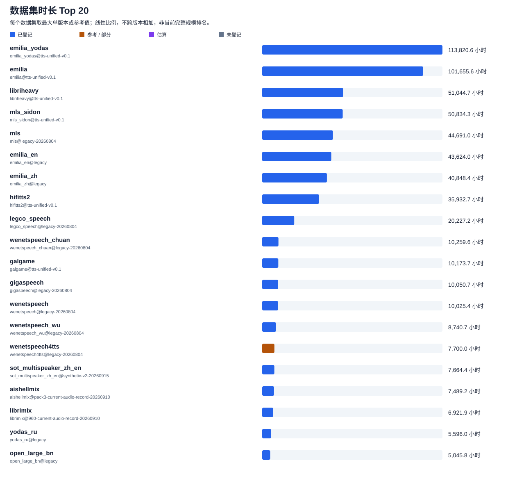

# 数据总览

按数据集查看语言、支持任务、时长和特性。清洗、热词、加噪、评测入口和训练框架配置归入所属数据集，不另算一套源数据。

当前登记 **130 个数据集条目**；另有 **20 个下载来源声明**和 **1 个训练混合配方**。登记不代表本机文件已齐备。

时长单位为小时。不同版本、子集和标注片段可能重叠，逐项列出，不相加为总量；没有时长的条目仍保留。参考表数字未核实当前文件与划分覆盖；“过滤前”不能当作清洗后时长。已被合并版本取代（`superseded_by`）的旧版本不再列出，仍可按原 ID 和版本解析。

任务是该数据集各已登记版本的能力并集，具体版本和划分以链接内声明为准。标点、热词和文件哈希校验都不能单独证明做过内容清洗。

## 数据规模与登记覆盖

每个数据集仅取最大的一项完整版本登记、参考或估算时长，并标出对应版本。部分划分和过滤前时长不参与排名；不同颜色区分登记值与参考 / 估算值。排名用于查看量级，不代表最新版本或整个数据集的完整时长。

覆盖图按数据集互斥分类：优先计入“至少一个版本有完整时长登记”，其次是“仅参考、估算或部分时长”，其余为“尚未登记”。完整登记只针对对应版本，不代表整个数据集所有子集和版本均已覆盖。

## 英文数据

| 数据集 | 语言 | 支持任务 | 时长（小时，注明范围） | 特性 / 备注 |
|---|---|---|---|---|
| [ami](../../catalog/icefall_runtime.yaml#L2909) | en | 语音识别 | 92.1（已登记；[单远场麦克风标注片段](../../catalog/icefall_runtime.yaml#L2909)） | 标注片段时长，重叠语音或多麦克风可能重复计时。训练集缺少 2 场会议（134/136） |
| [audioset_esc_test](../../catalog/open_audio_eval.yaml#L1385) | en | 背景声场景描述 | 6.8（已登记；[eval-20260804](../../catalog/open_audio_eval.yaml#L1385)） | 当前仅登记评测入口 |
| [chime6](../../catalog/chime6.yaml#L1) | en | 语音识别、重叠语音检测、带说话人标注的语音识别、说话人分段与归属 | 56.3（已登记；[speaker-records-v1-20260912](../../catalog/chime6.yaml#L149)） | 家庭聚会中的多通道远场和重叠语音；包含音频、官方转写、房间布局和许可文件。 官方转写原包保留尾随字节问题；标注入口使用解压内容不变、通过 CRC 校验的修复归档；已解包、实测音频头并生成通用说话人记录；保留官方划分和标注 |
| [common_voice_en](../../catalog/local_lhotse_derived.yaml#L307) | en | 语音识别、热词增强语音识别 | 1,862.7（已登记；[icefall-20260908](../../catalog/icefall_runtime.yaml#L311)） 1,862.7（已登记；[legacy-20260804](../../catalog/icefall_base.yaml#L260)） 27.2（已登记；[eval-20260804](../../catalog/open_audio_eval.yaml#L280)） 1,835.4（已登记；[clean-v1-20260805](../../catalog/local_lhotse_derived.yaml#L307)） 27.2（已登记；[eval-20260804](../../catalog/open_audio_eval.yaml#L350)） 1,835.4（已登记；[hotwords-v1-20260805](../../catalog/local_lhotse_derived.yaml#L409)） 27.2（已登记；[eval-20260804](../../catalog/open_audio_eval.yaml#L1698)） 27.2（已登记；[eval-20260804](../../catalog/open_audio_eval.yaml#L2402)） 27.2（已登记；[eval-20260804](../../catalog/open_audio_eval.yaml#L1666)） 27.2（已登记；[eval-20260804](../../catalog/open_audio_eval.yaml#L2370)） 27.2（已登记；[eval-20260804](../../catalog/open_audio_eval.yaml#L1634)） 27.2（已登记；[eval-20260804](../../catalog/open_audio_eval.yaml#L2338)） 27.2（已登记；[eval-20260804](../../catalog/open_audio_eval.yaml#L1570)） 27.2（已登记；[eval-20260804](../../catalog/open_audio_eval.yaml#L2274)） 27.2（已登记；[eval-20260804](../../catalog/open_audio_eval.yaml#L1538)） 27.2（已登记；[eval-20260804](../../catalog/open_audio_eval.yaml#L2242)） 27.2（已登记；[eval-20260804](../../catalog/open_audio_eval.yaml#L1602)） 27.2（已登记；[eval-20260804](../../catalog/open_audio_eval.yaml#L2306)） 27.2（已登记；[eval-20260804](../../catalog/open_audio_eval.yaml#L1730)） 27.2（已登记；[eval-20260804](../../catalog/open_audio_eval.yaml#L2434)） 27.2（已登记；[eval-20260804](../../catalog/open_audio_eval.yaml#L1506)） 27.2（已登记；[eval-20260804](../../catalog/open_audio_eval.yaml#L2210)） 27.2（已登记；[eval-20260804](../../catalog/open_audio_eval.yaml#L1410)） 27.2（已登记；[eval-20260804](../../catalog/open_audio_eval.yaml#L2114)） 27.2（已登记；[eval-20260804](../../catalog/open_audio_eval.yaml#L1474)） 27.2（已登记；[eval-20260804](../../catalog/open_audio_eval.yaml#L2178)） 27.2（已登记；[eval-20260804](../../catalog/open_audio_eval.yaml#L1442)） 27.2（已登记；[eval-20260804](../../catalog/open_audio_eval.yaml#L2146)） 1,854.0（[参考表](https://ccnuebbmik1f.feishu.cn/wiki/CEXFwEjPoi2bIukVjk9c5FdOn12?sheet=3d4d23)；legacy-20260804） | Qwen3-ASR-1.7B + whisper-large-v3 双引擎筛选；train 需过滤 1,127 条失败记录；test 清单尚未应用筛选结果；含派生版本（与源数据可能重叠） |
| [cs_dialogue_en](../../catalog/icefall_base.yaml#L1683) | en | 语音识别 | 26.6（已登记；[icefall-20260908](../../catalog/icefall_runtime.yaml#L2099)） 26.6（已登记；[legacy-20260804](../../catalog/icefall_base.yaml#L1683)） | 含派生版本（与源数据可能重叠） |
| [emilia_en](../../catalog/legacy_multilingual.yaml#L895) | en | 语音识别 | 43,624.0（已登记；[legacy](../../catalog/legacy_multilingual.yaml#L895)） | 参考表注明 clean2604，Whisper + Qwen3ASR 转录、已有清洗；本次未复核实际样本；有含标点版本 |
| [emotion1200_en](../../catalog/open_audio_eval.yaml#L1022) | en | 说话人情感分类、情感与说话风格描述、语音情感识别 | 5.2（已登记；[eval-20260804](../../catalog/open_audio_eval.yaml#L1022)） 5.2（已登记；[eval-20260804](../../catalog/open_audio_eval.yaml#L1086)） 5.2（已登记；[eval-20260804](../../catalog/open_audio_eval.yaml#L958)） | 当前仅登记评测入口 |
| [fleurs_en](../../catalog/legacy_multilingual.yaml#L826) | en | 语音识别 | 10.3（已登记；[legacy](../../catalog/legacy_multilingual.yaml#L826)） | 有含标点版本 |
| [gigaspeech](../../catalog/icefall_base.yaml#L188) | en | 语音识别 | 40.3（已登记；[eval-20260804](../../catalog/open_audio_eval.yaml#L218)） 10,050.7（已登记；[icefall-20260908](../../catalog/icefall_runtime.yaml#L229)） 10,050.7（已登记；[legacy-20260804](../../catalog/icefall_base.yaml#L188)） 10,000.0（[参考表](https://ccnuebbmik1f.feishu.cn/wiki/CEXFwEjPoi2bIukVjk9c5FdOn12?sheet=3d4d23)；legacy-20260804） | 含派生版本（与源数据可能重叠） |
| [hifitts](../../catalog/tts_unified.yaml#L249) | en | 语音识别、语音合成 | 291.7（已登记；[tts-unified-v0.1](../../catalog/tts_unified.yaml#L249)） | 音频编码字节存放在 Lance 表内；原始划分在 metadata_json.original_split，统一输出全部为 train。ASR 用 tts_lance.iter_asr_samples（tts-asr-rules/v1）读取，会排除原始 dev/test 等 |
| [hifitts2](../../catalog/tts_unified.yaml#L289) | en | 语音识别、语音合成 | 35,932.7（已登记；[tts-unified-v0.1](../../catalog/tts_unified.yaml#L289)） | 音频编码字节存放在 Lance 表内；原始划分在 metadata_json.original_split，统一输出全部为 train。ASR 用 tts_lance.iter_asr_samples（tts-asr-rules/v1）读取，会排除原始 dev/test 等 |
| [iemocap_ser](../../catalog/open_audio_eval.yaml#L883) | en | 语音情感识别 | 1.5（已登记；[eval-20260804](../../catalog/open_audio_eval.yaml#L883)） | 当前仅登记评测入口 |
| [legco_speech_en](../../catalog/icefall_base.yaml#L1875) | en | 语音识别 | 249.6（已登记；[icefall-20260908](../../catalog/icefall_runtime.yaml#L2289)） 249.6（已登记；[legacy-20260804](../../catalog/icefall_base.yaml#L1875)） | 含派生版本（与源数据可能重叠） |
| [libri2mix](../../catalog/open_audio_eval.yaml#L1229) | en | 目标说话人语音识别 | 8.4（已登记；[eval-20260804](../../catalog/open_audio_eval.yaml#L1229)） 8.4（已登记；[eval-20260804](../../catalog/open_audio_eval.yaml#L1333)） 8.4（已登记；[eval-20260804](../../catalog/open_audio_eval.yaml#L1281)） 11.2（已登记；[eval-20260804](../../catalog/open_audio_eval.yaml#L1150)） | 当前仅登记评测入口 |
| [libri3mix](../../catalog/open_audio_eval.yaml#L1255) | en | 目标说话人语音识别 | 10.9（已登记；[eval-20260804](../../catalog/open_audio_eval.yaml#L1255)） 10.9（已登记；[eval-20260804](../../catalog/open_audio_eval.yaml#L1359)） 10.9（已登记；[eval-20260804](../../catalog/open_audio_eval.yaml#L1307)） 16.3（已登记；[eval-20260804](../../catalog/open_audio_eval.yaml#L1176)） | 当前仅登记评测入口 |
| [libriheavy](../../catalog/tts_unified.yaml#L329) | en | 语音识别、语音合成 | 51,044.7（已登记；[tts-unified-v0.1](../../catalog/tts_unified.yaml#L329)） | 音频编码字节存放在 Lance 表内；原始划分在 metadata_json.original_split，统一输出全部为 train。ASR 用 tts_lance.iter_asr_samples（tts-asr-rules/v1）读取，会排除原始 dev/test 等 |
| [librimix](../../catalog/librimix.yaml#L156) | en | 目标说话人语音识别 | 6,921.9（已登记；[按目标样本累计混合音频，非去重语料时长](../../catalog/librimix.yaml#L156)） 6,865.5（已登记；[按目标样本累计混合音频，非去重语料时长](../../catalog/librimix.yaml#L482)） | LibriMix_960 当前训练与测试（英文小写）；纯转写、独立 enrollment/mixture、空转写负样本；LibriMix_960 当前训练与测试（英文小写）；转换输入快照，时长见通用版本；LibriMix_960 历史训练入口（保留原英文大小写）；纯转写、独立 enrollment/mixture、空转写负样本；LibriMix_960 历史训练入口（保留原英文大小写）；转换输入快照，时长见通用版本 |
| [librispeech](../../catalog/icefall_base.yaml#L1) | en | 语音识别、热词增强语音识别 | 971.6（已登记；[icefall-20260908](../../catalog/icefall_runtime.yaml#L1)） 971.6（已登记；[legacy-20260804](../../catalog/icefall_base.yaml#L1)） 5.4（已登记；[eval-20260804](../../catalog/open_audio_eval.yaml#L662)） 5.4（已登记；[eval-20260804](../../catalog/open_audio_eval.yaml#L510)） 5.3（已登记；[eval-20260804](../../catalog/open_audio_eval.yaml#L694)） 5.3（已登记；[eval-20260804](../../catalog/open_audio_eval.yaml#L542)） 10.7（已登记；[recipe-1](../../catalog/icefall_traffic_derived.yaml#L1)） 10.7（已登记；[recipe-1](../../catalog/icefall_traffic_derived.yaml#L247)） 10.7（已登记；[recipe-1](../../catalog/icefall_traffic_derived.yaml#L370)） 10.7（已登记；[recipe-1](../../catalog/icefall_traffic_derived.yaml#L493)） 10.7（已登记；[recipe-1](../../catalog/icefall_traffic_derived.yaml#L124)） 960.0（[参考表](https://ccnuebbmik1f.feishu.cn/wiki/CEXFwEjPoi2bIukVjk9c5FdOn12?sheet=3d4d23)；legacy-20260804） | 含派生版本（与源数据可能重叠） |
| [libritts_r](../../catalog/tts_unified.yaml#L369) | en | 语音识别、语音合成 | 583.1（已登记；[tts-unified-v0.1](../../catalog/tts_unified.yaml#L369)） | 音频编码字节存放在 Lance 表内；原始划分在 metadata_json.original_split，统一输出全部为 train。ASR 用 tts_lance.iter_asr_samples（tts-asr-rules/v1）读取，会排除原始 dev/test 等 |
| [ljspeech](../../catalog/tts_unified.yaml#L409) | en | 语音识别、语音合成 | 23.9（已登记；[tts-unified-v0.1](../../catalog/tts_unified.yaml#L409)） | 音频编码字节存放在 Lance 表内；原始划分在 metadata_json.original_split，统一输出全部为 train。ASR 用 tts_lance.iter_asr_samples（tts-asr-rules/v1）读取，会排除原始 dev/test 等 |
| [meld_ser](../../catalog/open_audio_eval.yaml#L852) | en | 语音情感识别 | 2.3（已登记；[eval-20260804](../../catalog/open_audio_eval.yaml#L852)） | 当前仅登记评测入口 |
| [mls](../../catalog/icefall_base.yaml#L116) | en | 语音识别 | 15.5（已登记；[eval-20260804](../../catalog/open_audio_eval.yaml#L249)） 44,691.0（已登记；[icefall-20260908](../../catalog/icefall_runtime.yaml#L147)） 44,691.0（已登记；[legacy-20260804](../../catalog/icefall_base.yaml#L116)） 44,500.0（[参考表](https://ccnuebbmik1f.feishu.cn/wiki/CEXFwEjPoi2bIukVjk9c5FdOn12?sheet=3d4d23)；legacy-20260804） | 含派生版本（与源数据可能重叠） |
| [msp_podcast_ser](../../catalog/open_audio_eval.yaml#L914) | en | 语音情感识别 | 未登记 | 当前仅登记评测入口 |
| [notsofar](../../catalog/icefall_runtime.yaml#L2988) | en | 语音识别、连续语音分离、重叠语音检测、带说话人标注的语音识别、说话人分段与归属 | 200.0（估算；[hf-ba8fd0f034ce-sim-v1.5-200h](../../catalog/multilingual_multispeaker.yaml#L416)） 176.9（已登记；[单远场麦克风标注片段](../../catalog/icefall_runtime.yaml#L2988)） | 标注片段时长，重叠语音或多麦克风可能重复计时 |
| [singapore_english](../../catalog/icefall_base.yaml#L371) | en | 语音识别 | 3.9（已登记；[icefall-20260908](../../catalog/icefall_runtime.yaml#L429)） 3.9（已登记；[legacy-20260804](../../catalog/icefall_base.yaml#L371)） 2.0（[参考表](https://ccnuebbmik1f.feishu.cn/wiki/CEXFwEjPoi2bIukVjk9c5FdOn12?sheet=3d4d23)；legacy-20260804） | 新加坡英语；登记 cleaned 标注，尚未核实清洗引擎和规则；含派生版本（与源数据可能重叠） |
| [singaporean](../../catalog/icefall_base.yaml#L332) | en | 语音识别 | 0.1（已登记；[icefall-20260908](../../catalog/icefall_runtime.yaml#L393)） 0.1（已登记；[legacy-20260804](../../catalog/icefall_base.yaml#L332)） 0.2（[参考表](https://ccnuebbmik1f.feishu.cn/wiki/CEXFwEjPoi2bIukVjk9c5FdOn12?sheet=3d4d23)；legacy-20260804） | 新加坡英语；登记 cleaned 标注，尚未核实清洗引擎和规则；含派生版本（与源数据可能重叠） |
| [tal100_en](../../catalog/icefall_base.yaml#L427) | en | 语音识别 | 4.8（已登记；[icefall-20260908](../../catalog/icefall_runtime.yaml#L488)） 4.8（已登记；[legacy-20260804](../../catalog/icefall_base.yaml#L427)） | 含派生版本（与源数据可能重叠） |
| [vctk](../../catalog/tts_unified.yaml#L540) | en | 语音识别、语音合成 | 82.7（已登记；[tts-unified-v0.1](../../catalog/tts_unified.yaml#L540)） | 音频编码字节存放在 Lance 表内；原始划分在 metadata_json.original_split，统一输出全部为 train。ASR 用 tts_lance.iter_asr_samples（tts-asr-rules/v1）读取，会排除原始 dev/test 等 |

## 中文及粤语数据

| 数据集 | 语言 | 支持任务 | 时长（小时，注明范围） | 特性 / 备注 |
|---|---|---|---|---|
| [3dspeaker](../../catalog/3dspeaker.yaml#L1) | zh | 说话人身份识别、声纹验证 | 1,275.3（已登记；[speaker-records-v1-20260912](../../catalog/3dspeaker.yaml#L120)） | 跨设备、距离和方言声纹数据；包含三个官方验证配对清单，转写只覆盖普通话；已解包、实测音频头并生成通用说话人记录；保留官方划分和标注 |
| [aidatatang](../../catalog/zh_source_clean.yaml#L327) | zh | 语音识别、热词增强语音识别 | 145.3（已登记；[clean-dual-qwen-moss-v1-20261008](../../catalog/zh_source_clean.yaml#L327)） 145.5（已登记；[icefall-20260908](../../catalog/icefall_runtime.yaml#L1606)） 145.5（已登记；[legacy-20260804](../../catalog/icefall_base.yaml#L1228)） 145.5（已登记；[hotwords-v1-20260805](../../catalog/local_lhotse_derived.yaml#L927)） 140.0（[参考表](https://ccnuebbmik1f.feishu.cn/wiki/CEXFwEjPoi2bIukVjk9c5FdOn12?sheet=3d4d23)；legacy-20260804） | aidatatang@icefall-20260908 的全部监督片段（上游称 train，实为含官方 dev/test 说话人的全量，故登记为 all），经 Qwen3-ASR-1.7B 与 MOSS-Transcribe-Diarize 双引擎一致性清洗；逐条写入 custom.clean（pass、reason、action、engine_status），不删除记录，读取时按 require_clean_pass 过滤。音频沿用源版本，不复制。规则 consensus-v6 / wenetspeech-faithful-v5：pass 236834、reject 431。少于 2 个字的 too_short 共 251 条按规则不经引擎直接 pass。用于合成时建议在 pass 之外再要求：两引擎均有效、MOSS 只输出 1 个说话人、action 不是 review_consensus；too_short 另要求两引擎规范化后与原文完全一致。按此筛选保留 220726 条、134.34 小时（too_short 通过 144/251）；含派生版本（与源数据可能重叠） |
| [aishell](../../catalog/icefall_base.yaml#L697) | zh | 语音识别、热词增强语音识别 | 10.0（已登记；[eval-20260804](../../catalog/open_audio_eval.yaml#L1)） 179.0（已登记；[icefall-20260908](../../catalog/icefall_runtime.yaml#L1005)） 179.0（已登记；[legacy-20260804](../../catalog/icefall_base.yaml#L697)） 10.0（已登记；[clean-v1-20260805](../../catalog/local_lhotse_derived.yaml#L600)） 10.0（已登记；[eval-20260804](../../catalog/open_audio_eval.yaml#L414)） 160.9（已登记；[hotwords-v1-20260805](../../catalog/local_lhotse_derived.yaml#L647)） 155.0（[参考表](https://ccnuebbmik1f.feishu.cn/wiki/CEXFwEjPoi2bIukVjk9c5FdOn12?sheet=3d4d23)；legacy-20260804） | 含派生版本（与源数据可能重叠） |
| [aishell2](../../catalog/icefall_base.yaml#L769) | zh | 语音识别、热词增强语音识别 | 4.0（已登记；[eval-20260804](../../catalog/open_audio_eval.yaml#L32)） 1,004.8（已登记；[icefall-20260908](../../catalog/icefall_runtime.yaml#L1087)） 1,004.8（已登记；[legacy-20260804](../../catalog/icefall_base.yaml#L769)） 4.0（已登记；[clean-v1-20260805](../../catalog/local_lhotse_derived.yaml#L718)） 4.0（已登记；[eval-20260804](../../catalog/open_audio_eval.yaml#L446)） 4.0（已登记；[hotwords-v1-20260805](../../catalog/local_lhotse_derived.yaml#L764)） 1,036.0（[参考表](https://ccnuebbmik1f.feishu.cn/wiki/CEXFwEjPoi2bIukVjk9c5FdOn12?sheet=3d4d23)；legacy-20260804） | 含派生版本（与源数据可能重叠） |
| [aishell3](../../catalog/zh_source_clean.yaml#L166) | zh | 语音识别、热词增强语音识别、语音合成 | 63.1（已登记；[clean-dual-qwen-moss-v1-20261008](../../catalog/zh_source_clean.yaml#L166)） 22.4（已登记；[eval-20260804](../../catalog/open_audio_eval.yaml#L63)） 85.6（已登记；[icefall-20260908](../../catalog/icefall_runtime.yaml#L1140)） 85.6（已登记；[legacy-20260804](../../catalog/icefall_base.yaml#L824)） 85.6（已登记；[tts-unified-v0.1](../../catalog/tts_unified.yaml#L1)） 22.4（已登记；[eval-20260804](../../catalog/open_audio_eval.yaml#L478)） 85.6（已登记；[hotwords-v1-20260805](../../catalog/local_lhotse_derived.yaml#L810)） 65.0（[参考表](https://ccnuebbmik1f.feishu.cn/wiki/CEXFwEjPoi2bIukVjk9c5FdOn12?sheet=3d4d23)；legacy-20260804） | aishell3@icefall-20260908 的 train 监督片段，经 Qwen3-ASR-1.7B 与 MOSS-Transcribe-Diarize 双引擎一致性清洗；逐条写入 custom.clean（pass、reason、action、engine_status），不删除记录，读取时按 require_clean_pass 过滤。音频沿用源版本，不复制。规则 consensus-v6 / wenetspeech-faithful-v5：pass 63219、reject 43。少于 2 个字的 too_short 共 1982 条按规则不经引擎直接 pass。用于合成时建议在 pass 之外再要求：两引擎均有效、MOSS 只输出 1 个说话人、action 不是 review_consensus；too_short 另要求两引擎规范化后与原文完全一致。按此筛选保留 57965 条、57.77 小时（too_short 通过 1898/1982）；音频编码字节存放在 Lance 表内；原始划分在 metadata_json.original_split，统一输出全部为 train。ASR 用 tts_lance.iter_asr_samples（tts-asr-rules/v1）读取，会排除原始 dev/test 等；含派生版本（与源数据可能重叠） |
| [aishell4](../../catalog/icefall_base.yaml#L879) | zh | 语音识别 | 119.5（已登记；[icefall-20260908](../../catalog/icefall_runtime.yaml#L1199)） 28.4（已登记；[legacy-20260804](../../catalog/icefall_base.yaml#L879)） | 含派生版本（与源数据可能重叠） |
| [aishellmix](../../catalog/aishellmix.yaml#L380) | zh | 目标说话人语音识别 | 6,733.1（已登记；[按目标样本累计混合音频，非去重语料时长](../../catalog/aishellmix.yaml#L380)） 7,489.2（已登记；[按目标样本累计混合音频，非去重语料时长](../../catalog/aishellmix.yaml#L114)） | AISHELLMix 原版历史训练（enrollment 至少 2 秒）与项目测试数据；纯转写、独立 enrollment/mixture、空转写负样本；AISHELLMix 原版历史训练（enrollment 至少 2 秒）与项目测试数据；转换输入快照，时长见通用版本；AISHELLMix pack3 当前与历史等价训练数据；纯转写、独立 enrollment/mixture、空转写负样本；AISHELLMix pack3 当前与历史等价训练数据；转换输入快照，时长见通用版本 |
| [alimeeting](../../catalog/alimeeting_far_raw.yaml#L1) | zh | 语音识别、连续语音分离、重叠语音检测、带说话人标注的语音识别、说话人分段与归属 | 125.5（已登记；[openslr-119-far-local-20260903](../../catalog/alimeeting_far_raw.yaml#L1)） 157.9（已登记；[openslr-119-local-20260826](../../catalog/multilingual_multispeaker.yaml#L1)） 157.9（已登记；[单远场麦克风标注片段](../../catalog/icefall_runtime.yaml#L2832)） | 远场会议、多说话人、重叠语音；训练集 8 条标注越界，使用前需处理；标注片段时长，重叠语音或多麦克风可能重复计时 |
| [biic_podcast_ser](../../catalog/open_audio_eval.yaml#L790) | zh | 语音情感识别 | 22.6（已登记；[eval-20260804](../../catalog/open_audio_eval.yaml#L790)） | 当前仅登记评测入口 |
| [childmandarin](../../catalog/icefall_base.yaml#L1434) | zh | 语音识别 | 41.0（已登记；[icefall-20260908](../../catalog/icefall_runtime.yaml#L1842)） 41.0（已登记；[legacy-20260804](../../catalog/icefall_base.yaml#L1434)） | 含派生版本（与源数据可能重叠） |
| [cnceleb1](../../catalog/cnceleb1.yaml#L1) | zh | 说话人身份识别、声纹验证 | 270.1（已登记；[speaker-records-v1-20260912](../../catalog/cnceleb1.yaml#L58)） | 中文跨场景声纹数据，修正版 v2；train 对应官方 dev，test 对应官方 eval；已解包、实测音频头并生成通用说话人记录；保留官方划分和标注 |
| [cnceleb2](../../catalog/cnceleb2.yaml#L1) | zh | 说话人身份识别、声纹验证 | 1,084.3（已登记；[speaker-records-v1-20260912](../../catalog/cnceleb2.yaml#L78)） | 中文跨场景声纹训练数据，修正版 v2；三个分包按 aa、ab、ac 顺序构成同一个 tar.gz；已解包、实测音频头并生成通用说话人记录；保留官方划分和标注 |
| [common_voice_zh](../../catalog/icefall_base.yaml#L1297) | zh | 语音识别、热词增强语音识别 | 76.1（已登记；[icefall-20260908](../../catalog/icefall_runtime.yaml#L1678)） 76.1（已登记；[legacy-20260804](../../catalog/icefall_base.yaml#L1297)） 17.5（已登记；[eval-20260804](../../catalog/open_audio_eval.yaml#L318)） 17.5（已登记；[clean-v1-20260805](../../catalog/local_lhotse_derived.yaml#L482)） 17.5（已登记；[eval-20260804](../../catalog/open_audio_eval.yaml#L382)） 60.0（已登记；[hotwords-v1-20260805](../../catalog/local_lhotse_derived.yaml#L529)） 17.4（已登记；[eval-20260804](../../catalog/open_audio_eval.yaml#L2050)） 17.4（已登记；[eval-20260804](../../catalog/open_audio_eval.yaml#L2754)） 17.4（已登记；[eval-20260804](../../catalog/open_audio_eval.yaml#L2018)） 17.4（已登记；[eval-20260804](../../catalog/open_audio_eval.yaml#L2722)） 17.4（已登记；[eval-20260804](../../catalog/open_audio_eval.yaml#L1986)） 17.4（已登记；[eval-20260804](../../catalog/open_audio_eval.yaml#L2690)） 17.4（已登记；[eval-20260804](../../catalog/open_audio_eval.yaml#L1922)） 17.4（已登记；[eval-20260804](../../catalog/open_audio_eval.yaml#L2626)） 17.4（已登记；[eval-20260804](../../catalog/open_audio_eval.yaml#L1890)） 17.4（已登记；[eval-20260804](../../catalog/open_audio_eval.yaml#L2594)） 17.4（已登记；[eval-20260804](../../catalog/open_audio_eval.yaml#L1954)） 17.4（已登记；[eval-20260804](../../catalog/open_audio_eval.yaml#L2658)） 17.4（已登记；[eval-20260804](../../catalog/open_audio_eval.yaml#L2082)） 17.4（已登记；[eval-20260804](../../catalog/open_audio_eval.yaml#L2786)） 17.4（已登记；[eval-20260804](../../catalog/open_audio_eval.yaml#L1858)） 17.4（已登记；[eval-20260804](../../catalog/open_audio_eval.yaml#L2562)） 17.4（已登记；[eval-20260804](../../catalog/open_audio_eval.yaml#L1762)） 17.4（已登记；[eval-20260804](../../catalog/open_audio_eval.yaml#L2466)） 17.4（已登记；[eval-20260804](../../catalog/open_audio_eval.yaml#L1826)） 17.4（已登记；[eval-20260804](../../catalog/open_audio_eval.yaml#L2530)） 17.4（已登记；[eval-20260804](../../catalog/open_audio_eval.yaml#L1794)） 17.4（已登记；[eval-20260804](../../catalog/open_audio_eval.yaml#L2498)） 43.0（[参考表](https://ccnuebbmik1f.feishu.cn/wiki/CEXFwEjPoi2bIukVjk9c5FdOn12?sheet=3d4d23)；legacy-20260804） | 含派生版本（与源数据可能重叠） |
| [common_voice_zh_hk](../../catalog/icefall_base.yaml#L2087) | yue | 语音识别 | 25.3（已登记；[icefall-20260908](../../catalog/icefall_runtime.yaml#L2497)） 25.3（已登记；[legacy-20260804](../../catalog/icefall_base.yaml#L2087)） | 含派生版本（与源数据可能重叠） |
| [cs_dialogue](../../catalog/icefall_base.yaml#L1618) | zh | 语音识别 | 46.0（已登记；[icefall-20260908](../../catalog/icefall_runtime.yaml#L2035)） 46.0（已登记；[legacy-20260804](../../catalog/icefall_base.yaml#L1618)） | 含派生版本（与源数据可能重叠） |
| [csemotions](../../catalog/tts_unified.yaml#L41) | zh | 语音合成 | 10.2（已登记；[tts-unified-v0.1](../../catalog/tts_unified.yaml#L41)） | 音频编码字节存放在 Lance 表内；原始划分在 metadata_json.original_split，统一输出全部为 train。ASR 用 tts_lance.iter_asr_samples（tts-asr-rules/v1）读取，会排除原始 dev/test 等 |
| [emilia_zh](../../catalog/legacy_multilingual.yaml#L2335) | zh | 语音识别 | 23,956.0（已登记；[icefall-20260908](../../catalog/icefall_runtime.yaml#L975)） 40,848.4（已登记；[legacy](../../catalog/legacy_multilingual.yaml#L2335)） 23,956.0（已登记；[legacy-20260804](../../catalog/icefall_base.yaml#L665)） 23,956.0（[参考表](https://ccnuebbmik1f.feishu.cn/wiki/CEXFwEjPoi2bIukVjk9c5FdOn12?sheet=3d4d23)；legacy-20260804） | 参考表注明 clean2604，Whisper + Qwen3ASR 转录、已有清洗；本次未复核实际样本；有含标点版本；含派生版本（与源数据可能重叠） |
| [emotion1200_zh](../../catalog/open_audio_eval.yaml#L1054) | zh | 说话人情感分类、情感与说话风格描述、语音情感识别 | 4.9（已登记；[eval-20260804](../../catalog/open_audio_eval.yaml#L1054)） 4.9（已登记；[eval-20260804](../../catalog/open_audio_eval.yaml#L1118)） 4.9（已登记；[eval-20260804](../../catalog/open_audio_eval.yaml#L990)） | 当前仅登记评测入口 |
| [fleurs_zh](../../catalog/legacy_multilingual.yaml#L2266) | zh | 语音识别 | 14.1（已登记；[icefall-20260908](../../catalog/icefall_runtime.yaml#L1888)） 14.1（已登记；[legacy](../../catalog/legacy_multilingual.yaml#L2266)） 14.1（已登记；[legacy-20260804](../../catalog/icefall_base.yaml#L1481)） | 有含标点版本；含派生版本（与源数据可能重叠） |
| [hi_mia](../../catalog/hi_mia.yaml#L1) | zh | 说话人身份识别、声纹验证 | 533.6（已登记；[speaker-records-v1-20260912](../../catalog/hi_mia.yaml#L100)） | 固定中文唤醒词的远场声纹验证；使用修复损坏音频的 test_v2，含官方同人/异人配对答案；已解包、实测音频头并生成通用说话人记录；保留官方划分和标注 |
| [kespeech](../../catalog/icefall_base.yaml#L1136) | zh | 语音识别、热词增强语音识别 | 31.1（已登记；[eval-20260804](../../catalog/open_audio_eval.yaml#L125)） 1,434.8（已登记；[icefall-20260908](../../catalog/icefall_runtime.yaml#L1494)） 1,434.8（已登记；[legacy-20260804](../../catalog/icefall_base.yaml#L1136)） 31.1（已登记；[clean-v1-20260805](../../catalog/local_lhotse_derived.yaml#L85)） 31.1（已登记；[hotwords-v1-20260805](../../catalog/local_lhotse_derived.yaml#L128)） 1,428.0（[参考表](https://ccnuebbmik1f.feishu.cn/wiki/CEXFwEjPoi2bIukVjk9c5FdOn12?sheet=3d4d23)；legacy-20260804） | 含派生版本（与源数据可能重叠） |
| [legco_speech](../../catalog/icefall_base.yaml#L1844) | yue | 语音识别 | 20,227.2（已登记；[icefall-20260908](../../catalog/icefall_runtime.yaml#L2259)） 20,227.2（已登记；[legacy-20260804](../../catalog/icefall_base.yaml#L1844)） | 含派生版本（与源数据可能重叠） |
| [m3ed_ser](../../catalog/open_audio_eval.yaml#L821) | zh | 语音情感识别 | 1.7（已登记；[eval-20260804](../../catalog/open_audio_eval.yaml#L821)） | 当前仅登记评测入口 |
| [magicdata](../../catalog/zh_source_clean.yaml#L496) | zh | 语音识别、热词增强语音识别 | 711.0（已登记；[clean-dual-qwen-moss-v1-20261008](../../catalog/zh_source_clean.yaml#L496)） 28.1（已登记；[eval-20260804](../../catalog/open_audio_eval.yaml#L94)） 754.7（已登记；[icefall-20260908](../../catalog/icefall_runtime.yaml#L1348)） 754.7（已登记；[legacy-20260804](../../catalog/icefall_base.yaml#L999)） 711.9（已登记；[hotwords-v1-20260805](../../catalog/local_lhotse_derived.yaml#L175)） 747.0（[参考表](https://ccnuebbmik1f.feishu.cn/wiki/CEXFwEjPoi2bIukVjk9c5FdOn12?sheet=3d4d23)；legacy-20260804） | magicdata@icefall-20260908 的 train 监督片段，经 Qwen3-ASR-1.7B 与 MOSS-Transcribe-Diarize 双引擎一致性清洗；逐条写入 custom.clean（pass、reason、action、engine_status），不删除记录，读取时按 require_clean_pass 过滤。音频沿用源版本，不复制。规则 consensus-v6 / wenetspeech-faithful-v5：pass 572637、reject 841。少于 2 个字的 too_short 共 241 条按规则不经引擎直接 pass。用于合成时建议在 pass 之外再要求：两引擎均有效、MOSS 只输出 1 个说话人、action 不是 review_consensus；too_short 另要求两引擎规范化后与原文完全一致。按此筛选保留 525329 条、644.54 小时（too_short 通过 136/241）；含派生版本（与源数据可能重叠） |
| [magicdata_ramc](../../catalog/zh_source_clean.yaml#L659) | zh | 语音识别 | 125.0（已登记；[clean-dual-qwen-moss-v1-20261008](../../catalog/zh_source_clean.yaml#L659)） 150.7（已登记；[icefall-20260908](../../catalog/icefall_runtime.yaml#L1430)） 150.7（已登记；[legacy-20260804](../../catalog/icefall_base.yaml#L1071)） | magicdata_ramc@icefall-20260908 的 train 监督片段，经 Qwen3-ASR-1.7B 与 MOSS-Transcribe-Diarize 双引擎一致性清洗；逐条写入 custom.clean（pass、reason、action、engine_status），不删除记录，读取时按 require_clean_pass 过滤。音频沿用源版本，不复制。规则 consensus-v6 / wenetspeech-faithful-v5：pass 166711、reject 1753。少于 2 个字的 too_short 共 16573 条按规则不经引擎直接 pass。用于合成时建议在 pass 之外再要求：两引擎均有效、MOSS 只输出 1 个说话人、action 不是 review_consensus；too_short 另要求两引擎规范化后与原文完全一致。按此筛选保留 122956 条、88.85 小时（too_short 通过 10332/16573）；含派生版本（与源数据可能重叠） |
| [mdcc](../../catalog/icefall_base.yaml#L1906) | yue | 语音识别 | 73.6（已登记；[icefall-20260908](../../catalog/icefall_runtime.yaml#L2319)） 73.6（已登记；[legacy-20260804](../../catalog/icefall_base.yaml#L1906)） 11.0（已登记；[icefall-20260908](../../catalog/icefall_runtime.yaml#L3913)） 11.0（已登记；[recipe-1](../../catalog/icefall_traffic_derived.yaml#L68)） 11.0（已登记；[icefall-20260908](../../catalog/icefall_runtime.yaml#L4115)） 11.0（已登记；[recipe-1](../../catalog/icefall_traffic_derived.yaml#L314)） 11.0（已登记；[icefall-20260908](../../catalog/icefall_runtime.yaml#L4216)） 11.0（已登记；[recipe-1](../../catalog/icefall_traffic_derived.yaml#L437)） 11.0（已登记；[icefall-20260908](../../catalog/icefall_runtime.yaml#L4317)） 11.0（已登记；[recipe-1](../../catalog/icefall_traffic_derived.yaml#L560)） 11.0（已登记；[icefall-20260908](../../catalog/icefall_runtime.yaml#L4014)） 11.0（已登记；[recipe-1](../../catalog/icefall_traffic_derived.yaml#L191)） | 含派生版本（与源数据可能重叠） |
| [police_asr_unified](../../catalog/police_asr_unified.yaml#L1) | zh | 语音识别 | 805.6（已登记；[v1-20261009](../../catalog/police_asr_unified.yaml#L1)） | 警务合成语音统合版：V1-V6 全部批次合并为 train/dev/test 三个集合，不复制音频 |
| [primewords](../../catalog/zh_source_clean.yaml#L1) | zh | 语音识别 | 98.4（已登记；[clean-dual-qwen-moss-v1-20261008](../../catalog/zh_source_clean.yaml#L1)） 99.0（已登记；[icefall-20260908](../../catalog/icefall_runtime.yaml#L1642)） 99.0（已登记；[legacy-20260804](../../catalog/icefall_base.yaml#L1266)） | primewords@icefall-20260908 的 train 监督片段，经 Qwen3-ASR-1.7B 与 MOSS-Transcribe-Diarize 双引擎一致性清洗；逐条写入 custom.clean（pass、reason、action、engine_status），不删除记录，读取时按 require_clean_pass 过滤。音频沿用源版本，不复制。规则 consensus-v6 / wenetspeech-faithful-v5：pass 50119、reject 265。少于 2 个字的 too_short 共 12 条按规则不经引擎直接 pass。用于合成时建议在 pass 之外再要求：两引擎均有效、MOSS 只输出 1 个说话人、action 不是 review_consensus；too_short 另要求两引擎规范化后与原文完全一致。按此筛选保留 41860 条、82.06 小时（too_short 通过 4/12）；含派生版本（与源数据可能重叠） |
| [realman](../../catalog/icefall_runtime.yaml#L3107) | zh | 语音识别 | 83.7（已登记；[已准备标注片段](../../catalog/icefall_runtime.yaml#L3107)） | 标注片段时长，重叠语音或多麦克风可能重复计时 |
| [speechio](../../catalog/legacy_multilingual.yaml#L2374) | zh | 语音识别 | 63.8（已登记；[legacy](../../catalog/legacy_multilingual.yaml#L2374)） | 有含标点版本 |
| [tal100_zh](../../catalog/icefall_base.yaml#L1369) | zh | 语音识别 | 5.5（已登记；[icefall-20260908](../../catalog/icefall_runtime.yaml#L1760)） 5.5（已登记；[legacy-20260804](../../catalog/icefall_base.yaml#L1369)） | 含派生版本（与源数据可能重叠） |
| [thchs30](../../catalog/icefall_base.yaml#L927) | zh | 语音识别、热词增强语音识别 | 6.3（已登记；[eval-20260804](../../catalog/open_audio_eval.yaml#L156)） 34.2（已登记；[icefall-20260908](../../catalog/icefall_runtime.yaml#L1266)） 34.2（已登记；[legacy-20260804](../../catalog/icefall_base.yaml#L927)） 25.5（已登记；[hotwords-v1-20260805](../../catalog/local_lhotse_derived.yaml#L881)） 35.0（[参考表](https://ccnuebbmik1f.feishu.cn/wiki/CEXFwEjPoi2bIukVjk9c5FdOn12?sheet=3d4d23)；legacy-20260804） | 含派生版本（与源数据可能重叠） |
| [wenetspeech](../../catalog/icefall_base.yaml#L492) | zh | 语音识别 | 2,409.6（已登记；[clean-weak-v1-20260904](../../catalog/wenetspeech_weak.yaml#L46)） 10,025.4（已登记；[icefall-20260908](../../catalog/icefall_runtime.yaml#L570)） 10,025.4（已登记；[legacy-20260804](../../catalog/icefall_base.yaml#L492)） 2,477.9（已登记；[weak-source-20260904](../../catalog/wenetspeech_weak.yaml#L1)） 10,005.4（已登记；[clean-v1-20260805](../../catalog/local_lhotse_derived.yaml#L264)） 9,971.1（已登记；[clean-v3-20260828](../../catalog/local_lhotse_derived.yaml#L975)） 15.2（已登记；[eval-20260804](../../catalog/open_audio_eval.yaml#L758)） 23.1（已登记；[eval-20260804](../../catalog/open_audio_eval.yaml#L726)） 23.1（已登记；[recipe-1](../../catalog/icefall_traffic_derived.yaml#L40)） 23.1（已登记；[recipe-1](../../catalog/icefall_traffic_derived.yaml#L286)） 23.1（已登记；[recipe-1](../../catalog/icefall_traffic_derived.yaml#L409)） 23.1（已登记；[recipe-1](../../catalog/icefall_traffic_derived.yaml#L532)） 23.1（已登记；[recipe-1](../../catalog/icefall_traffic_derived.yaml#L163)） 10,000.0（[参考表](https://ccnuebbmik1f.feishu.cn/wiki/CEXFwEjPoi2bIukVjk9c5FdOn12?sheet=3d4d23)；legacy-20260804） | 含派生版本（与源数据可能重叠） |
| [wenetspeech4tts](../../catalog/tts_unified.yaml#L580) | zh | 语音识别、语音合成 | 7,232.2（已登记；[icefall-20260908](../../catalog/icefall_runtime.yaml#L706)） 7,232.2（已登记；[legacy-20260804](../../catalog/icefall_base.yaml#L577)） 7,232.2（已登记；[tts-unified-v0.1](../../catalog/tts_unified.yaml#L580)） 7,700.0（[参考表](https://ccnuebbmik1f.feishu.cn/wiki/CEXFwEjPoi2bIukVjk9c5FdOn12?sheet=3d4d23)；legacy-20260804） | 音频编码字节存放在 Lance 表内；原始划分在 metadata_json.original_split，统一输出全部为 train。ASR 用 tts_lance.iter_asr_samples（tts-asr-rules/v1）读取，会排除原始 dev/test 等；含派生版本（与源数据可能重叠） |
| [wenetspeech_chuan](../../catalog/icefall_base.yaml#L615) | zh | 语音识别 | 10,259.6（已登记；[icefall-20260908](../../catalog/icefall_runtime.yaml#L927)） 10,259.6（已登记；[legacy-20260804](../../catalog/icefall_base.yaml#L615)） | 含派生版本（与源数据可能重叠） |
| [wenetspeech_disfluency](../../catalog/icefall_runtime.yaml#L677) | zh | 语音识别 | 182.5（已登记；[icefall-20260908](../../catalog/icefall_runtime.yaml#L677)） | 已登记划分：train |
| [wenetspeech_wu](../../catalog/icefall_base.yaml#L640) | zh | 语音识别 | 8,740.7（已登记；[icefall-20260908](../../catalog/icefall_runtime.yaml#L951)） 8,740.7（已登记；[legacy-20260804](../../catalog/icefall_base.yaml#L640)） | 含派生版本（与源数据可能重叠） |
| [wenetspeech_yue](../../catalog/icefall_base.yaml#L1971) | yue | 语音识别 | 未登记 | 含派生版本（与源数据可能重叠） |
| [wenetspeech_yue_all](../../catalog/icefall_base.yaml#L2029) | yue | 语音识别 | 未登记 | 含派生版本（与源数据可能重叠） |

## 混合语言及多语数据

| 数据集 | 语言 | 支持任务 | 时长（小时，注明范围） | 特性 / 备注 |
|---|---|---|---|---|
| [cs_dialogue_mix](../../catalog/icefall_base.yaml#L1748) | en、zh | 语音识别 | 31.0（已登记；[icefall-20260908](../../catalog/icefall_runtime.yaml#L2163)） 31.0（已登记；[legacy-20260804](../../catalog/icefall_base.yaml#L1748)） | 含派生版本（与源数据可能重叠） |
| [cumix2017](../../catalog/icefall_base.yaml#L1813) | en、yue | 语音识别 | 10.9（已登记；[icefall-20260908](../../catalog/icefall_runtime.yaml#L2228)） 10.9（已登记；[legacy-20260804](../../catalog/icefall_base.yaml#L1813)） | 含派生版本（与源数据可能重叠） |
| [emilia](../../catalog/tts_unified.yaml#L79) | de、en、fr、ja、ko、zh | 语音识别、语音合成 | 101,655.6（已登记；[tts-unified-v0.1](../../catalog/tts_unified.yaml#L79)） | 音频编码字节存放在 Lance 表内；原始划分在 metadata_json.original_split，统一输出全部为 train。ASR 用 tts_lance.iter_asr_samples（tts-asr-rules/v1）读取，会排除原始 dev/test 等 |
| [emilia_yodas](../../catalog/tts_unified.yaml#L124) | de、en、fr、ja、ko、zh | 语音识别、语音合成 | 113,820.6（已登记；[tts-unified-v0.1](../../catalog/tts_unified.yaml#L124)） | 音频编码字节存放在 Lance 表内；原始划分在 metadata_json.original_split，统一输出全部为 train。ASR 用 tts_lance.iter_asr_samples（tts-asr-rules/v1）读取，会排除原始 dev/test 等 |
| [genshin_voice](../../catalog/tts_unified.yaml#L208) | en-US、ja、ko、zh | 语音合成 | 1,039.7（已登记；[tts-unified-v0.1](../../catalog/tts_unified.yaml#L208)） | 音频编码字节存放在 Lance 表内；原始划分在 metadata_json.original_split，统一输出全部为 train。ASR 用 tts_lance.iter_asr_samples（tts-asr-rules/v1）读取，会排除原始 dev/test 等 |
| [indicvoices](../../catalog/multilingual_multispeaker.yaml#L164) | as、bn、brx、doi、gu、hi、kn、kok、ks、mai、ml、mni、mr、ne、or、pa、sa、sat、sd、ta、te、ur | 语音识别 | 未登记 | 已登记划分：all |
| [meeting_benchmark](../../catalog/meeting_180s_benchmark.yaml#L1) | en、zh、zh-en | 带说话人标注的语音识别 | 21.2（已登记；[v1-20261008](../../catalog/meeting_180s_benchmark.yaml#L1)） | 部署长度（约 180 秒）会议转写评测集：AISHELL-4 test、AliMeeting Test、AMI SDM test 各会议均匀取 6 个窗口，另有中文 / 英文 / 中英混合 6、8、10 人远场合成会议各 10 段；共 424 段 21.2 小时。仅用于评测 |
| [meeting_selection_panel](../../catalog/meeting_selection_panel.yaml#L1) | en、zh | 带说话人标注的语音识别 | 12.4（已登记；[v1-20261008](../../catalog/meeting_selection_panel.yaml#L1)） | 独立会议选模面板：AliMeeting 官方 Eval 8 场全部 120 秒窗口（中文）、NOTSOFAR 官方 dev 36 场每场一台设备的全部 120 秒窗口（英文 3–7 人）、CHiME-6 官方 dev 2 场全部 120 秒窗口（英文晚宴，仅报告）。不进训练，不按难度筛选 |
| [mls_sidon](../../catalog/tts_unified.yaml#L449) | de、en、es、fr、it、nl、pl、pt | 语音识别、语音合成 | 50,834.3（已登记；[tts-unified-v0.1](../../catalog/tts_unified.yaml#L449)） | 音频编码字节存放在 Lance 表内；原始划分在 metadata_json.original_split，统一输出全部为 train。ASR 用 tts_lance.iter_asr_samples（tts-asr-rules/v1）读取，会排除原始 dev/test 等 |
| [multi-talker-sd](../../catalog/multilingual_multispeaker.yaml#L219) | en、zh | 语音识别、语码转换语音识别、连续语音分离、重叠语音检测、带说话人标注的语音识别、说话人分段与归属 | 未登记 | 已登记划分：dev、test、train |
| [sot_multispeaker_zh_en](../../catalog/sot_multispeaker_zh_en.yaml#L1) | en、zh、zh-en | 带说话人标注的语音识别 | 7,664.4（已登记；[synthetic-v2-20260915](../../catalog/sot_multispeaker_zh_en.yaml#L1)） | 1～5 人中英混音，完整按人转写；200 万 train、1 万 dev、1 万 test。原版没有字词对齐时间戳；时间戳版本已登记、尚在准备：复用 v2 原混音，新增每次发言起止时间。源对齐和质检未全部完成，尚未发布可训练记录；不将计划条数计为已完成数据；含派生版本（与源数据可能重叠） |
| [starrail_voice](../../catalog/tts_unified.yaml#L497) | en、ja、ko、zh-CN | 语音合成 | 692.6（已登记；[tts-unified-v0.1](../../catalog/tts_unified.yaml#L497)） | 音频编码字节存放在 Lance 表内；原始划分在 metadata_json.original_split，统一输出全部为 train。ASR 用 tts_lance.iter_asr_samples（tts-asr-rules/v1）读取，会排除原始 dev/test 等 |
| [talcs](../../catalog/icefall_base.yaml#L1546) | en、zh | 语音识别、热词增强语音识别 | 23.6（已登记；[eval-20260804](../../catalog/open_audio_eval.yaml#L187)） 587.6（已登记；[icefall-20260908](../../catalog/icefall_runtime.yaml#L1952)） 587.6（已登记；[legacy-20260804](../../catalog/icefall_base.yaml#L1546)） 555.9（已登记；[hotwords-v1-20260805](../../catalog/local_lhotse_derived.yaml#L221)） 23.6（已登记；[icefall-20260908](../../catalog/icefall_runtime.yaml#L3937)） 23.6（已登记；[recipe-1](../../catalog/icefall_traffic_derived.yaml#L96)） 23.6（已登记；[icefall-20260908](../../catalog/icefall_runtime.yaml#L4139)） 23.6（已登记；[recipe-1](../../catalog/icefall_traffic_derived.yaml#L342)） 23.6（已登记；[icefall-20260908](../../catalog/icefall_runtime.yaml#L4240)） 23.6（已登记；[recipe-1](../../catalog/icefall_traffic_derived.yaml#L465)） 23.6（已登记；[icefall-20260908](../../catalog/icefall_runtime.yaml#L4341)） 23.6（已登记；[recipe-1](../../catalog/icefall_traffic_derived.yaml#L588)） 23.6（已登记；[icefall-20260908](../../catalog/icefall_runtime.yaml#L4038)） 23.6（已登记；[recipe-1](../../catalog/icefall_traffic_derived.yaml#L219)） 300.0（[参考表](https://ccnuebbmik1f.feishu.cn/wiki/CEXFwEjPoi2bIukVjk9c5FdOn12?sheet=3d4d23)；legacy-20260804） | 含派生版本（与源数据可能重叠） |
| [ts_hw_test](../../catalog/open_audio_eval.yaml#L1202) | en、zh | 目标说话人语音识别 | 7.7（已登记；[eval-20260804](../../catalog/open_audio_eval.yaml#L1202)） | 当前仅登记评测入口 |
| [vitw](../../catalog/icefall_runtime.yaml#L3067) | en、zh | 语音识别 | 1,085.4（已登记；[icefall-20260908](../../catalog/icefall_runtime.yaml#L2561)） 1,085.4（已登记；[legacy-20260804](../../catalog/icefall_base.yaml#L2152)） 77.3（已登记；[远场子集](../../catalog/icefall_runtime.yaml#L3067)） 0.3（已登记；[eval-20260804](../../catalog/open_audio_eval.yaml#L2818)） 0.3（已登记；[eval-20260804](../../catalog/open_audio_eval.yaml#L2851)） 0.3（已登记；[eval-20260804](../../catalog/open_audio_eval.yaml#L2884)） 0.3（已登记；[eval-20260804](../../catalog/open_audio_eval.yaml#L2917)） 1.0（已登记；[eval-20260804](../../catalog/open_audio_eval.yaml#L2950)） 0.3（已登记；[eval-20260804](../../catalog/open_audio_eval.yaml#L2983)） 0.3（已登记；[eval-20260804](../../catalog/open_audio_eval.yaml#L3016)） 0.3（已登记；[eval-20260804](../../catalog/open_audio_eval.yaml#L3049)） 0.8（已登记；[eval-20260804](../../catalog/open_audio_eval.yaml#L3082)） 0.8（已登记；[eval-20260804](../../catalog/open_audio_eval.yaml#L3115)） 0.8（已登记；[eval-20260804](../../catalog/open_audio_eval.yaml#L3148)） 0.8（已登记；[eval-20260804](../../catalog/open_audio_eval.yaml#L3181)） 2.3（已登记；[eval-20260804](../../catalog/open_audio_eval.yaml#L3214)） 0.8（已登记；[eval-20260804](../../catalog/open_audio_eval.yaml#L3247)） 0.8（已登记；[eval-20260804](../../catalog/open_audio_eval.yaml#L3280)） 0.8（已登记；[eval-20260804](../../catalog/open_audio_eval.yaml#L3313)） | 标注片段时长，重叠语音或多麦克风可能重复计时；含派生版本（与源数据可能重叠） |
| [waxal-asr](../../catalog/multilingual_multispeaker.yaml#L288) | ach、aka、am、dag、dga、ee、ff、kpo、lg、ln、mas、mg、nyn、om、sid、sn、sog、ti、wal | 语音识别 | 未登记 | 已登记划分：all |
| [wutheringwaves](../../catalog/tts_unified.yaml#L620) | en、ja、ko、zh | 语音合成 | 134.8（已登记；[tts-unified-v0.1](../../catalog/tts_unified.yaml#L620)） | 音频编码字节存放在 Lance 表内；原始划分在 metadata_json.original_split，统一输出全部为 train。ASR 用 tts_lance.iter_asr_samples（tts-asr-rules/v1）读取，会排除原始 dev/test 等 |

## 其他语言数据

| 数据集 | 语言 | 支持任务 | 时长（小时，注明范围） | 特性 / 备注 |
|---|---|---|---|---|
| [audioset_road_traffic](../../catalog/audioset_road_traffic.yaml#L1) | und | noise | 未登记 | 已登记划分：all |
| [banspeech_bn](../../catalog/legacy_multilingual.yaml#L241) | bn | 语音识别 | 6.5（已登记；[legacy](../../catalog/legacy_multilingual.yaml#L241)） | 有无标点版本 |
| [cbtts_bn](../../catalog/legacy_multilingual.yaml#L274) | bn | 语音识别 | 20.1（已登记；[legacy](../../catalog/legacy_multilingual.yaml#L274)） | 有含标点版本 |
| [ciempiess](../../catalog/ciempiess_light.yaml#L1) | es | 语音识别 | 18.4（已登记；[hf-3d6afb2b3b8d](../../catalog/ciempiess_light.yaml#L1)） | 墨西哥西语 CIEMPIESS LIGHT 官方完整版本 |
| [cml_tts_fr](../../catalog/legacy_multilingual.yaml#L1216) | fr | 语音识别 | 316.0（已登记；[legacy](../../catalog/legacy_multilingual.yaml#L1216)） | 有含标点版本 |
| [common_voice_ar](../../catalog/legacy_multilingual.yaml#L1) | ar | 语音识别 | 58.2（已登记；[legacy](../../catalog/legacy_multilingual.yaml#L1)） | 有含标点版本 |
| [common_voice_bn](../../catalog/legacy_multilingual.yaml#L307) | bn | 语音识别 | 67.4（已登记；[legacy](../../catalog/legacy_multilingual.yaml#L307)） | 有含标点版本 |
| [common_voice_de](../../catalog/legacy_multilingual.yaml#L544) | de | 语音识别 | 1,034.8（已登记；[legacy](../../catalog/legacy_multilingual.yaml#L544)） | 有含标点版本 |
| [common_voice_es](../../catalog/legacy_multilingual.yaml#L934) | es | 语音识别 | 568.5（已登记；[legacy](../../catalog/legacy_multilingual.yaml#L934)） | 有含标点版本 |
| [common_voice_fr](../../catalog/legacy_multilingual.yaml#L1285) | fr | 语音识别 | 924.1（已登记；[legacy](../../catalog/legacy_multilingual.yaml#L1285)） | 有含标点版本 |
| [common_voice_ja](../../catalog/legacy_multilingual.yaml#L1567) | ja | 语音识别 | 48.2（已登记；[legacy](../../catalog/legacy_multilingual.yaml#L1567)） | 有含标点版本 |
| [common_voice_ko](../../catalog/legacy_multilingual.yaml#L1771) | ko | 语音识别 | 2.6（已登记；[legacy](../../catalog/legacy_multilingual.yaml#L1771)） | 有含标点版本 |
| [common_voice_ru](../../catalog/legacy_multilingual.yaml#L2026) | ru | 语音识别 | 69.9（已登记；[legacy](../../catalog/legacy_multilingual.yaml#L2026)） | 有含标点版本 |
| [dns5_noise_rir](../../catalog/dns5_noise_rir.yaml#L1) | und | rir、speech_enhancement | 未登记 | 官方脚本列出的全部 7 个 AudioSet 噪声包、2 个 Freesound 噪声包及 1 个脉冲响应包；不包含干净语音 |
| [emilia_ja](../../catalog/legacy_multilingual.yaml#L1636) | ja | 语音识别 | 1,715.5（已登记；[legacy](../../catalog/legacy_multilingual.yaml#L1636)） | 有含标点版本 |
| [emilia_ko](../../catalog/legacy_multilingual.yaml#L1840) | ko | 语音识别 | 217.2（已登记；[legacy](../../catalog/legacy_multilingual.yaml#L1840)） | 有含标点版本 |
| [fleurs_ar](../../catalog/legacy_multilingual.yaml#L70) | ar | 语音识别 | 8.2（已登记；[legacy](../../catalog/legacy_multilingual.yaml#L70)） | 有含标点版本 |
| [fleurs_bn](../../catalog/legacy_multilingual.yaml#L376) | bn | 语音识别 | 15.6（已登记；[legacy](../../catalog/legacy_multilingual.yaml#L376)） | 有含标点版本 |
| [fleurs_de](../../catalog/legacy_multilingual.yaml#L613) | de | 语音识别 | 13.4（已登记；[legacy](../../catalog/legacy_multilingual.yaml#L613)） | 有含标点版本 |
| [fleurs_es](../../catalog/legacy_multilingual.yaml#L1003) | es | 语音识别 | 13.2（已登记；[legacy](../../catalog/legacy_multilingual.yaml#L1003)） | 有含标点版本 |
| [fleurs_fr](../../catalog/legacy_multilingual.yaml#L1354) | fr | 语音识别 | 13.1（已登记；[legacy](../../catalog/legacy_multilingual.yaml#L1354)） | 有含标点版本 |
| [fleurs_ja](../../catalog/legacy_multilingual.yaml#L1669) | ja | 语音识别 | 10.7（已登记；[legacy](../../catalog/legacy_multilingual.yaml#L1669)） | 有含标点版本 |
| [fleurs_ko](../../catalog/legacy_multilingual.yaml#L1873) | ko | 语音识别 | 10.1（已登记；[legacy](../../catalog/legacy_multilingual.yaml#L1873)） | 有含标点版本 |
| [fleurs_ru](../../catalog/legacy_multilingual.yaml#L2095) | ru | 语音识别 | 11.6（已登记；[legacy](../../catalog/legacy_multilingual.yaml#L2095)） | 有含标点版本 |
| [galgame](../../catalog/tts_unified.yaml#L170) | ja | 语音合成 | 10,173.7（已登记；[tts-unified-v0.1](../../catalog/tts_unified.yaml#L170)） | 音频编码字节存放在 Lance 表内；原始划分在 metadata_json.original_split，统一输出全部为 train。ASR 用 tts_lance.iter_asr_samples（tts-asr-rules/v1）读取，会排除原始 dev/test 等 |
| [gigaspeech2_id](../../catalog/local_lhotse_derived.yaml#L1) | id | 语音识别、热词增强语音识别 | 1,980.1（已登记；[local-20260805](../../catalog/local_lhotse_derived.yaml#L1)） 214.9（已登记；[hotwords-v1-20260805](../../catalog/local_lhotse_derived.yaml#L40)） | 含派生版本（与源数据可能重叠） |
| [koreaspeech](../../catalog/legacy_multilingual.yaml#L1942) | ko | 语音识别 | 3,828.3（已登记；[legacy](../../catalog/legacy_multilingual.yaml#L1942)） | 有含标点版本 |
| [mgb2](../../catalog/legacy_multilingual.yaml#L139) | ar | 语音识别 | 1,215.5（已登记；[legacy](../../catalog/legacy_multilingual.yaml#L139)） | 有无标点版本 |
| [mls_de](../../catalog/legacy_multilingual.yaml#L682) | de | 语音识别 | 1,995.1（已登记；[legacy](../../catalog/legacy_multilingual.yaml#L682)） | 有无标点版本 |
| [mls_es](../../catalog/legacy_multilingual.yaml#L1072) | es | 语音识别 | 937.7（已登记；[legacy](../../catalog/legacy_multilingual.yaml#L1072)） | 有无标点版本 |
| [mls_fr](../../catalog/legacy_multilingual.yaml#L1423) | fr | 语音识别 | 1,096.7（已登记；[legacy](../../catalog/legacy_multilingual.yaml#L1423)） | 有无标点版本 |
| [musan](../../catalog/musan.yaml#L1) | und | noise | 未登记 | 已登记划分：music、noise |
| [open_large_bn](../../catalog/legacy_multilingual.yaml#L445) | bn | 语音识别 | 5,045.8（已登记；[legacy](../../catalog/legacy_multilingual.yaml#L445)） | 有含标点版本 |
| [real_rir_slr28](../../catalog/icefall_runtime.yaml#L4450) | und | 音频增强、rir | 0.1（已登记；[prepared-20260908](../../catalog/icefall_runtime.yaml#L4450)） | Real room impulse responses only; not speech/transcription training examples |
| [rulibrispeech_ru](../../catalog/legacy_multilingual.yaml#L2164) | ru | 语音识别 | 98.2（已登记；[legacy](../../catalog/legacy_multilingual.yaml#L2164)） | 有含标点版本 |
| [sim_rir_slr26](../../catalog/sim_rir_slr26.yaml#L1) | und | rir | 未登记 | 已登记划分：all |
| [sim_rir_slr28](../../catalog/sim_rir_slr28.yaml#L1) | und | rir | 未登记 | 已登记划分：all |
| [slr37_bn](../../catalog/legacy_multilingual.yaml#L478) | bn | 语音识别 | 5.0（已登记；[legacy](../../catalog/legacy_multilingual.yaml#L478)） | 有无标点版本 |
| [yodas_ar](../../catalog/legacy_multilingual.yaml#L208) | ar | 语音识别 | 289.7（已登记；[legacy](../../catalog/legacy_multilingual.yaml#L208)） | 有含标点版本 |
| [yodas_bn](../../catalog/legacy_multilingual.yaml#L511) | bn | 语音识别 | 27.1（已登记；[legacy](../../catalog/legacy_multilingual.yaml#L511)） | 有含标点版本 |
| [yodas_de](../../catalog/legacy_multilingual.yaml#L793) | de | 语音识别 | 3,062.9（已登记；[legacy](../../catalog/legacy_multilingual.yaml#L793)） | 有含标点版本 |
| [yodas_es](../../catalog/legacy_multilingual.yaml#L1183) | es | 语音识别 | 3,737.8（已登记；[legacy](../../catalog/legacy_multilingual.yaml#L1183)） | 有含标点版本 |
| [yodas_fr](../../catalog/legacy_multilingual.yaml#L1534) | fr | 语音识别 | 2,423.7（已登记；[legacy](../../catalog/legacy_multilingual.yaml#L1534)） | 有含标点版本 |
| [yodas_ja](../../catalog/legacy_multilingual.yaml#L1738) | ja | 语音识别 | 1,094.2（已登记；[legacy](../../catalog/legacy_multilingual.yaml#L1738)） | 有含标点版本 |
| [yodas_ko](../../catalog/legacy_multilingual.yaml#L1993) | ko | 语音识别 | 2,774.3（已登记；[legacy](../../catalog/legacy_multilingual.yaml#L1993)） | 有含标点版本 |
| [yodas_ru](../../catalog/legacy_multilingual.yaml#L2233) | ru | 语音识别 | 5,596.0（已登记；[legacy](../../catalog/legacy_multilingual.yaml#L2233)） | 有含标点版本 |

## 下载来源声明

以下条目来自下载计划，仅登记来源、版本和预期位置；这里不据此判断已下载或可训练。已有旧版的数据集也可能列有新版本下载计划。

| 数据集 | 版本 | 语言 | 支持任务 |
|---|---|---|---|
| [aishell5](../../catalog/download_queue.yaml#L1) | 1.0 | zh | 语音识别 |
| [ciempiess](../../catalog/ciempiess_original.yaml#L1) | official-2014 | es | 语音识别 |
| [ciempiess](../../catalog/ciempiess_test.yaml#L1) | hf-c134fff8e335 | es | 语音识别 |
| [common_voice_en](../../catalog/download_queue.yaml#L59) | 26.0 | en | 语音识别 |
| [common_voice_es](../../catalog/common_voice_es.yaml#L1) | 26.0 | es | 语音识别 |
| [common_voice_pt](../../catalog/common_voice_pt.yaml#L1) | 26.0 | pt | 语音识别 |
| [common_voice_yue](../../catalog/download_queue.yaml#L139) | 26.0 | yue | 语音识别 |
| [common_voice_zh](../../catalog/download_queue.yaml#L86) | 26.0 | zh | 语音识别 |
| [common_voice_zh_hk](../../catalog/download_queue.yaml#L113) | 26.0 | yue | 语音识别 |
| [coraa_mupe](../../catalog/coraa_mupe.yaml#L1) | hf-437966f103b3 | pt-BR | 语音识别 |
| [gigaspeech2](../../catalog/download_queue.yaml#L165) | hf-8dc0d0e502b7 | id、th、vi | 语音识别 |
| [google_latam](../../catalog/google_latam.yaml#L1) | openslr-20260911 | es | 语音识别 |
| [granary](../../catalog/download_queue.yaml#L200) | hf-0fe23a860e35 | multi | 语音识别、语音翻译 |
| [lemas](../../catalog/download_queue.yaml#L250) | hf-91f0c1b9a29f | multi | 语音识别 |
| [loquacious_set](../../catalog/loquacious_set.yaml#L1) | hf-0e84cdb9e4b8 | en | 语音识别 |
| [mls_pt](../../catalog/mls_pt.yaml#L1) | openslr-94 | pt | 语音识别 |
| [omnilingual-asr-corpus](../../catalog/download_queue.yaml#L225) | hf-8648ba894637 | multi | 语音识别 |
| [peoples_speech](../../catalog/peoples_speech.yaml#L1) | hf-f10597c5d3d3 | en | 语音识别 |
| [reazonspeech](../../catalog/download_queue.yaml#L274) | hf-0df78f991f6a | ja | 语音识别 |
| [yodas_granary_es_pt](../../catalog/yodas_granary_es_pt.yaml#L1) | hf-969944574ea3 | es、pt | 语音识别 |

## 训练混合配方

这些配方复用上面的数据，不增加源数据集数量或时长。

- [icefall_v10_farfield_replay@prepared-20260908](../../catalog/icefall_v10_replay.yaml#L1)

## 已记录的质量证据

文件校验通过，不等于内容正确。以下仅列有明确记录的版本，缺少记录不代表质量差。

| 数据版本 | 当前结论 | 证据 | 注意事项 |
|---|---|---|---|
| [aidatatang@clean-dual-qwen-moss-v1-20261008](../../catalog/zh_source_clean.yaml#L327) | 有自动筛选记录 | 自动筛选通过 236,834 条、拒绝 431 条，通过率 99.82% | 未登记人工抽检；筛选通过不等于转写完全正确 |
| [aishell3@clean-dual-qwen-moss-v1-20261008](../../catalog/zh_source_clean.yaml#L166) | 有自动筛选记录 | 自动筛选通过 63,219 条、拒绝 43 条，通过率 99.93% | 未登记人工抽检；筛选通过不等于转写完全正确 |
| [alimeeting@openslr-119-far-local-20260903](../../catalog/alimeeting_far_raw.yaml#L1) | 有已知标注问题 | 训练集 8 条标注越过音频边界；开发集 0 条；测试集 0 条 | 最大越界 269.375 秒，使用前应处理异常标注 |
| [commonvoice_en_clean@clean-v1-20260805](../../catalog/local_lhotse_derived.yaml#L307) | 有自动筛选记录 | 自动筛选通过 1,142,149 条、拒绝 1,127 条，通过率 99.90% | 未登记人工抽检；筛选通过不等于转写完全正确 |
| [magicdata@clean-dual-qwen-moss-v1-20261008](../../catalog/zh_source_clean.yaml#L496) | 有自动筛选记录 | 自动筛选通过 572,637 条、拒绝 841 条，通过率 99.85% | 未登记人工抽检；筛选通过不等于转写完全正确 |
| [magicdata_ramc@clean-dual-qwen-moss-v1-20261008](../../catalog/zh_source_clean.yaml#L659) | 有自动筛选记录 | 自动筛选通过 166,711 条、拒绝 1,753 条，通过率 98.96% | 未登记人工抽检；筛选通过不等于转写完全正确 |
| [primewords@clean-dual-qwen-moss-v1-20261008](../../catalog/zh_source_clean.yaml#L1) | 有自动筛选记录 | 自动筛选通过 50,119 条、拒绝 265 条，通过率 99.47% | 未登记人工抽检；筛选通过不等于转写完全正确 |
| [wenetspeech@clean-weak-v1-20260904](../../catalog/wenetspeech_weak.yaml#L46) | 有自动筛选和人工抽检记录 | 自动筛选通过 3,149,292 条、拒绝 73,468 条，通过率 97.72% | 人工抽检 10 条，其中确认 10 条；样本很小，不能代表整集准确率 |

CV EN 的 train/test 清单落地差异见 [CV EN 清洗说明](cv-en-cleaning.md)。

## 数据声明与维护

- [目录说明](../../catalog/README.md)：声明格式、字段和统计规则。
- [组织规范](../reference/data-organization.md)：数据身份、版本、处理层与视图。
- 新增数据时登记任务、语言、特性和顶层 split 的 `statistics.duration_hours`；未知时长留空，不填 0。
- 更新 catalog 或 views 后运行 `audio-data-contract generate-overview`；CI 用 `--check` 检查本页同步。
